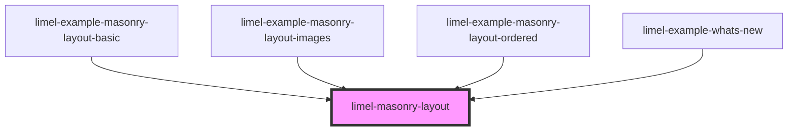

<!-- Auto Generated Below -->

## Overview

A responsive masonry grid layout component.

This component arranges slotted elements into a masonry-style grid,
where items are placed in the shortest column, resulting in a
Pinterest-like layout with minimal vertical gaps.

The component uses JavaScript to calculate positions, providing
reliable cross-browser support — unlike CSS-only approaches such as
`columns` or `grid-template-rows: masonry`, which have limited
browser support or produce poor results.

The number of columns is determined automatically based on the
available width and the minimum column width.

## Properties

| Property  | Attribute | Description                                                                                                                | Type      | Default |
| --------- | --------- | -------------------------------------------------------------------------------------------------------------------------- | --------- | ------- |
| `ordered` | `ordered` | When `true`, items are placed left-to-right in DOM order. When `false` (default), items are placed in the shortest column. | `boolean` | `false` |

## Slots

| Slot | Description                            |
| ---- | -------------------------------------- |
|      | Items to arrange in the masonry layout |

## Dependencies

### Used by

 - [limel-example-masonry-layout-basic](examples)
 - [limel-example-masonry-layout-images](examples)
 - [limel-example-masonry-layout-ordered](examples)
 - [limel-example-whats-new](../../examples/whats-new)

### Graph

----------------------------------------------

*Built with [StencilJS](https://stenciljs.com/)*
