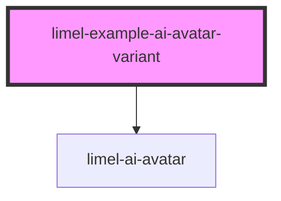

<!-- Auto Generated Below -->

## Overview

Variants

The `variant` property selects the avatar's visual style.
- The `detailed` variant is the fully detailed orb with reflections and shines;
- The `minimal` variant is a simplified design with a single gradient orb,
  a stroked outline, and a soft halo.
- The `solid` variant is a flat symbolic representation of the avatar (a
  filled disc and outer ring in `currentColor`), useful for compact or
  iconographic contexts.
- The `outlined` variant shares the `solid` variant's shape but renders the
  inner disc as a thin stroke too, so the avatar reads as two concentric
  rings. Its facial features default to `currentColor` as well.

Eye and mouth shapes — and all the animations driving them (blink,
look-around, etc.) — are shared across variants, so switching `variant`
changes the body but not the personality.

:::tip
Per Lime's branding guidelines, the `minimal` variant should be used in most cases.
The `minimal` variant suits some scenarios where the surrounding context
provides a realistic or detailed visual style, such as a 3D environment or
a video in real world footage.
The `solid` and `outlined` variants are ideal for compact spaces, such as
an app's user interface.
:::

## Dependencies

### Depends on

- [limel-ai-avatar](..)

### Graph

----------------------------------------------

*Built with [StencilJS](https://stenciljs.com/)*
