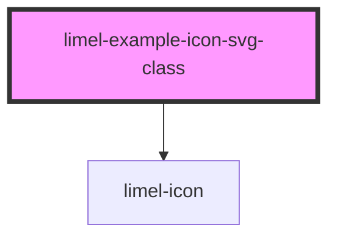

<!-- Auto Generated Below -->


## Overview

Setting a class on the inner SVG

`limel-icon` renders the icon's SVG inside its own shadow DOM. The
consumer's CSS can recolor the icon (using `color` and CSS custom properties),
or resize the icon simply by setting styles on `limel-icon`. However,
consumers can't naturally reach inside the shadow DOM and add HTML
attributes to the inner `<svg>`.

It is common for some SVG icons to have internal states, selectable by
adding a class to the `<svg>`.
For example, an icon file might contain rules that react to classes
like `mode-error`, or `mode-ok`; or have inbuilt animations that
respond to class changes.

The `svgClass` property is the escape hatch for such cases: it
forwards a class string onto the inner `<svg>`. So those icons
whose SVG file contains internal `<style>` blocks with rules that
react to classes can easily visualize their states through class
changes which are set by the consumer.

```html
<limel-icon name="status" svg-class="mode-error"></limel-icon>
```

If you swap `svgClass` at runtime, the new value replaces the old one
on the `<svg>`. The icon's internal CSS then re-evaluates and the
visual state changes — without re-fetching the file.

:::note
For typical stateless icons (the vast majority of any icon set),
`svgClass` has no visible effect. The SVG has no rules that react to
the class, so changing it does nothing. The example below renders an
ordinary icon with `svgClass` set, just to demonstrate the API. Open
the rendered element in the inspector to confirm the class is on the
inner `<svg>`.
:::

## Dependencies

### Depends on

- [limel-icon](..)

### Graph


----------------------------------------------

*Built with [StencilJS](https://stenciljs.com/)*
