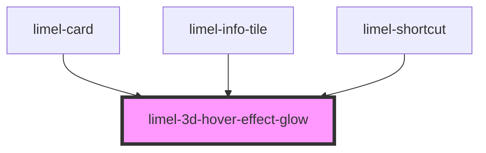

<!-- Auto Generated Below -->

## Overview

This component enhances the visual effects, when the `tiltFollowingTheCursor`
utility function from `3d-tilt-hover-effect.ts` is implemented in a component.

This component should be added to the HTML structure of the consumer component.

This component carries its own styles which are needed to create a glow effect on the
3D element within the parent element, when the parent is hovered.

The parent element must be using the `tiltFollowingTheCursor` utility function
imported from `3d-tilt-hover-effect.ts`. This function will dynamically
affect parts of the styles of this 3D glow effect.

## Dependencies

### Used by

 - [limel-card](../card)
 - [limel-info-tile](../info-tile)
 - [limel-shortcut](../shortcut)

### Graph

----------------------------------------------

*Built with [StencilJS](https://stenciljs.com/)*
