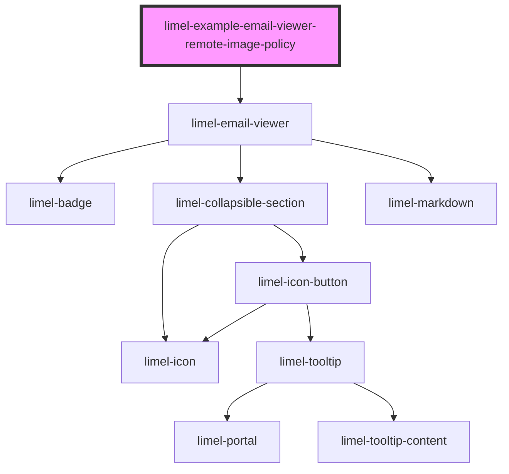

<!-- Auto Generated Below -->

## Overview

Email with remote image policy

Example showing an HTML email body where remote images are represented as
`data-remote-src`, which triggers the remote-images warning banner.

This mirrors the shape produced by `loadEmail`, where remote image URLs are
rewritten to `data-remote-src` and only restored when the user allows remote
images.

## Dependencies

### Depends on

- [limel-email-viewer](..)

### Graph

----------------------------------------------

*Built with [StencilJS](https://stenciljs.com/)*
