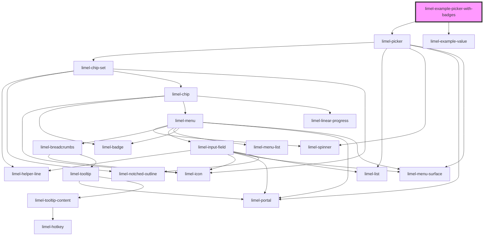

<!-- Auto Generated Below -->

## Overview

Picker with badges on picked chips

Set `badge` on a `PickerItem` to stamp the resulting chip with a
short status label or counter. The badge accepts a string
(e.g. `"Inactive"`, `"Beta"`) or a number (e.g. `12`).

Use it to surface metadata about the picked value at a glance
without forcing the consumer to read the chip text or open a
tooltip — for example, marking deactivated users in a group
picker, or flagging items that have unread notifications.

:::note
For long string labels you may need to override the
`--badge-max-width` CSS custom property on the host element of
the consuming component, since the default is tuned for short
numeric counters.
:::

## Dependencies

### Depends on

- [limel-picker](..)
- [limel-example-value](../../../examples)

### Graph

----------------------------------------------

*Built with [StencilJS](https://stenciljs.com/)*
