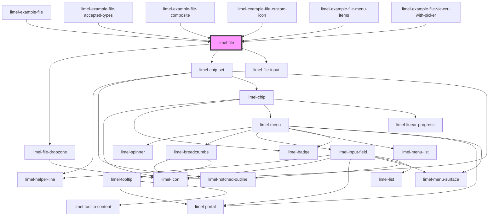

<!-- Auto Generated Below -->

## Overview

This component lets end-users select a *single* file from their device
storage. Regardless of the user's device or operating system, this component
opens up a file picker dialog that allows the user to choose a file.

## Using correct labels

This file picker can be used in different contexts. The component's distinct
visual design including the upload icon hints end-users that this is not a
normal input field like other fields in the form for example.

:::important
you need to use a descriptive `label` that clarifies the
functionality of the file picker, and/or provides users with clear
instructions.

Depending on the context, you may need to avoid labels such as:
- File
- Document

and instead consider using labels like:
- Attach a file
- Upload a file
- Choose a document
- Choose a file

and similar phrases...
:::

## Properties

| Property   | Attribute  | Description                                                                                                                 | Type                                                                   | Default     |
| ---------- | ---------- | --------------------------------------------------------------------------------------------------------------------------- | ---------------------------------------------------------------------- | ----------- |
| `accept`   | `accept`   | The [accepted file types](https://developer.mozilla.org/en-US/docs/Web/HTML/Element/input/file#unique_file_type_specifiers) | `string`                                                               | `'*'`       |
| `disabled` | `disabled` | True if the input should be disabled                                                                                        | `boolean`                                                              | `false`     |
| `invalid`  | `invalid`  | Set to `true` to indicate that the current value of the chosen file is invalid.                                             | `boolean`                                                              | `false`     |
| `label`    | `label`    | The input label.                                                                                                            | `string`                                                               | `undefined` |
| `language` | `language` | Defines the localisation for translations.                                                                                  | `"da" \| "de" \| "en" \| "fi" \| "fr" \| "nb" \| "nl" \| "no" \| "sv"` | `'en'`      |
| `readonly` | `readonly` | Set to `true` to disable adding and removing files, but allow interaction with any already existing file.                   | `boolean`                                                              | `false`     |
| `required` | `required` | Set to `true` to indicate that the field is required.                                                                       | `boolean`                                                              | `false`     |
| `value`    | --         | The selected file.                                                                                                          | `FileInfo`                                                             | `undefined` |

## Events

| Event      | Description                                   | Type                            |
| ---------- | --------------------------------------------- | ------------------------------- |
| `change`   | Dispatched when a file is selected/deselected | `CustomEvent<FileInfo>`         |
| `interact` | Dispatched when clicking on a chip            | `CustomEvent<number \| string>` |

## Dependencies

### Used by

 - [limel-example-file](examples)
 - [limel-example-file-accepted-types](examples)
 - [limel-example-file-composite](examples)
 - [limel-example-file-custom-icon](examples)
 - [limel-example-file-menu-items](examples)
 - [limel-example-file-viewer-with-picker](../file-viewer/examples)

### Depends on

- [limel-file-dropzone](../file-dropzone)
- [limel-chip-set](../chip-set)
- [limel-file-input](../file-input)

### Graph

----------------------------------------------

*Built with [StencilJS](https://stenciljs.com/)*
