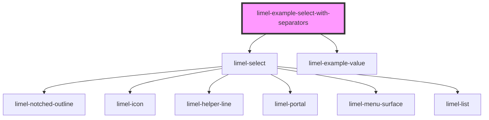

<!-- Auto Generated Below -->

## Overview

Select with separators between options

Separators are simple yet powerful design elements that can be
employed in lists of items. They offer significant usability advantages
by providing valuable visual cues that aid users in perceiving
and navigating through lists. Read more about advantages of using
separators in the
[List component's documentations](#/component/limel-list/).

## Dependencies

### Depends on

- [limel-select](..)
- [limel-example-value](../../../examples)

### Graph

----------------------------------------------

*Built with [StencilJS](https://stenciljs.com/)*
