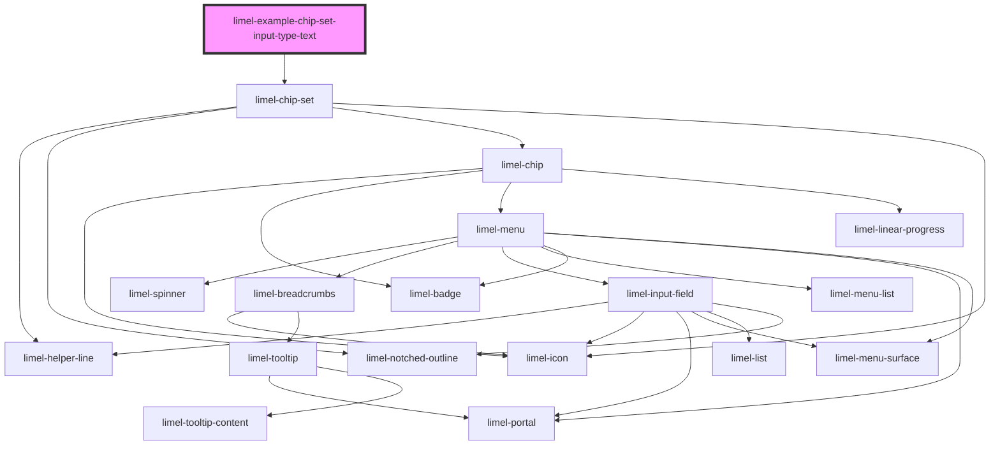

<!-- Auto Generated Below -->

## Overview

Input chip set with `inputType` of `text`

There is a slight difference in the way browsers treat `input` field
with `type="text"` and `type="search"`. You can read more about this
difference in [Mozilla's documentation](https://developer.mozilla.org/en-US/docs/Web/HTML/Element/input/search#using_search_inputs),
but the most important difference in this case is activation of the
autocorrection feature on most smart devices.

When a user makes a spelling mistake while typing in an input field with
`type="text"`, the mistake will be corrected automatically, right after they
press <kbd>Enter</kbd> or <kbd>Space</kbd>. Input fields with `type="search"`
do not auto correct the user's input.

If you want to use limel-chip-set in a form context, where autocorrection is
a good thing, use `text` as `inputType`. It is important to know that the
chip-set component creates a chip from the autocorrected value, after the
user has pressed the <kbd>Enter</kbd> key and the auto correction has fixed
existing typos! For example, for a question like "Please type five of your
favorite fruits", you would want to avoid misspellings, to collect higher
quality data.

## Dependencies

### Depends on

- [limel-chip-set](..)

### Graph

----------------------------------------------

*Built with [StencilJS](https://stenciljs.com/)*
