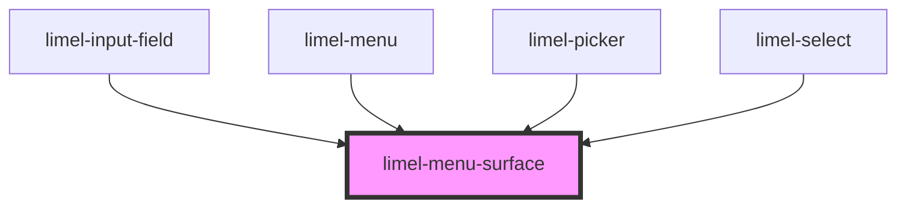

<!-- Auto Generated Below -->

## Properties

| Property             | Attribute | Description                                                                  | Type          | Default     |
| -------------------- | --------- | ---------------------------------------------------------------------------- | ------------- | ----------- |
| `allowClicksElement` | --        | Clicks in this element should not be prevented when the menu surface is open | `HTMLElement` | `undefined` |
| `open`               | `open`    | True if the menu surface is open, false otherwise                            | `boolean`     | `false`     |

## Events

| Event     | Description                                                     | Type                |
| --------- | --------------------------------------------------------------- | ------------------- |
| `dismiss` | Emitted when the menu surface is dismissed and should be closed | `CustomEvent<void>` |

## Slots

| Slot | Description                       |
| ---- | --------------------------------- |
|      | Content to put inside the surface |

## Dependencies

### Used by

 - [limel-input-field](../input-field)
 - [limel-menu](../menu)
 - [limel-picker](../picker)
 - [limel-select](../select)

### Graph

----------------------------------------------

*Built with [StencilJS](https://stenciljs.com/)*
