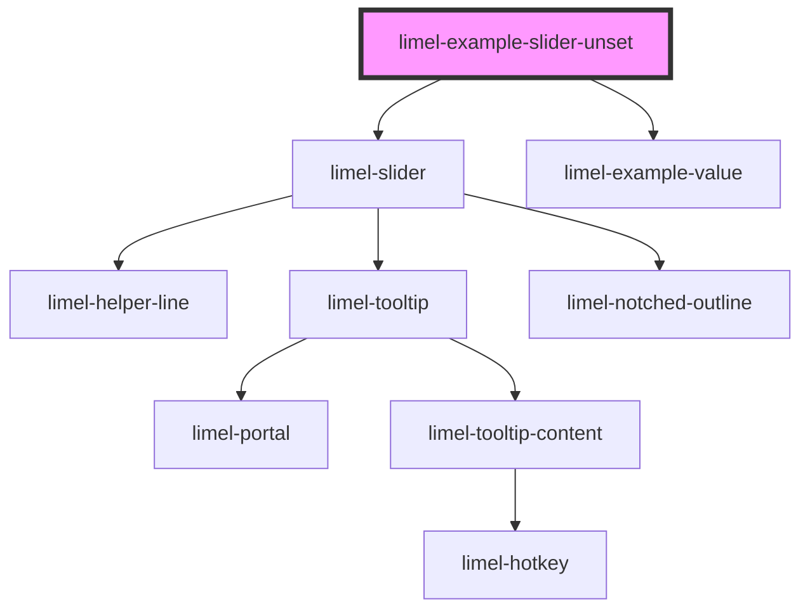

<!-- Auto Generated Below -->

## Overview

Unsetting the value

This slider is initialized *unset*, which means its `value` is `null`.
Therefore the thumb rests in the middle, and the value indicator shows a
left-right arrow (`↔`) instead of a number.
Assistive technologies announce the value as "Value not set".

As soon as the user drags the thumb, presses anywhere on the track, or
nudges the thumb with the arrow keys, the slider becomes set and the
trailing **clear** button becomes active.
Pressing it unsets the slider again, emitting `null` on the `change`
event — so a handler must accept `number | null`.

A `required` slider does not offer the clear button — a required value
cannot be unset — but it can still start unset to prompt a first choice.

To unset the slider programmatically, set its `value` to `null`. Any other
value that is not a finite number — `undefined`, or `NaN` — works too.

## Dependencies

### Depends on

- [limel-slider](..)
- [limel-example-value](../../../examples)

### Graph

----------------------------------------------

*Built with [StencilJS](https://stenciljs.com/)*
