<!-- Auto Generated Below -->

## Overview

A chart is a graphical representation of data, in which
visual symbols such as such bars, dots, lines, or slices, represent
each data point, in comparison to others.

## Properties

| Property                | Attribute                 | Description                                                                                                                                                                                                                                                                                                                                                                                                                                       | Type                                                                                                         | Default         |
| ----------------------- | ------------------------- | ------------------------------------------------------------------------------------------------------------------------------------------------------------------------------------------------------------------------------------------------------------------------------------------------------------------------------------------------------------------------------------------------------------------------------------------------- | ------------------------------------------------------------------------------------------------------------ | --------------- |
| `accessibleItemsLabel`  | `accessible-items-label`  | Helps users of assistive technologies to understand what the items in the chart represent. Defaults to the translation for "items" in the current language.                                                                                                                                                                                                                                                                                       | `string`                                                                                                     | `undefined`     |
| `accessibleLabel`       | `accessible-label`        | Helps users of assistive technologies to understand the context of the chart, and what is being displayed.                                                                                                                                                                                                                                                                                                                                        | `string`                                                                                                     | `undefined`     |
| `accessibleValuesLabel` | `accessible-values-label` | Helps users of assistive technologies to understand what the values in the chart represent. Defaults to the translation for "value" in the current language.                                                                                                                                                                                                                                                                                      | `string`                                                                                                     | `undefined`     |
| `axisIncrement`         | `axis-increment`          | Sets the axis increment for `bar`, `dot`, `area`, and `line` charts. Has no effect on other chart types.                                                                                                                                                                                                                                                                                                                                          | `number`                                                                                                     | `undefined`     |
| `displayAxisLabels`     | `display-axis-labels`     | When set to true, renders visible labels for X and Y axes. Only affects chart types with X and Y axes, such as area, bar, and line charts.                                                                                                                                                                                                                                                                                                        | `boolean`                                                                                                    | `false`         |
| `displayItemPercentage` | `display-item-percentage` | Set to `false` to hide the percentage in item tooltips. The percentage is an item's value or range extent as a share of the whole. The whole is `maxValue` when set and the combined items otherwise. Applies to `stacked-bar`, `pie`, `doughnut`, and `ring` charts.                                                                                                                                                                             | `boolean`                                                                                                    | `true`          |
| `displayItemText`       | `display-item-text`       | Makes the `text` of chart items constantly visible, By default, item texts are displayed in a tooltip, when the item is hovered or focused. Only affects chart types with X and Y axes, such as area, bar, and line charts.                                                                                                                                                                                                                       | `boolean`                                                                                                    | `false`         |
| `displayItemValue`      | `display-item-value`      | Makes the `value` (or `formattedValue`) of chart items constantly visible, By default, item values are displayed in a tooltip, when the item is hovered or focused. Only affects chart types with X and Y axes, such as area, bar, and line charts.                                                                                                                                                                                               | `boolean`                                                                                                    | `false`         |
| `items` _(required)_    | --                        | List of items in the chart, each representing a data point.                                                                                                                                                                                                                                                                                                                                                                                       | `ChartItem<number \| [number, number]>[]`                                                                    | `undefined`     |
| `language`              | `language`                | Defines the language for translations. Will translate the translatable strings on the components.                                                                                                                                                                                                                                                                                                                                                 | `"da" \| "de" \| "en" \| "fi" \| "fr" \| "nb" \| "nl" \| "no" \| "sv"`                                       | `'en'`          |
| `loading`               | `loading`                 | Indicates whether the chart is in a loading state.                                                                                                                                                                                                                                                                                                                                                                                                | `boolean`                                                                                                    | `false`         |
| `maxValue`              | `max-value`               | Sets the value used to scale item values. For `stacked-bar`, `pie`, `doughnut`, and `ring`, it is the denominator used as the whole. It defaults to the combined item values or range extents. The combined size can exceed `maxValue` and produce a total above 100%. For `bar`, `dot`, `area`, and `line`, it is the requested upper bound. The chart can round that bound up to the next `axisIncrement`. Has no effect on `nps` or `scatter`. | `number`                                                                                                     | `undefined`     |
| `orientation`           | `orientation`             | Defines whether the chart is intended to be displayed wide or tall. Does not have any effect on chart types which generate circular forms.                                                                                                                                                                                                                                                                                                        | `"landscape" \| "portrait"`                                                                                  | `'landscape'`   |
| `type`                  | `type`                    | Defines how items are visualized in the chart.                                                                                                                                                                                                                                                                                                                                                                                                    | `"area" \| "bar" \| "dot" \| "doughnut" \| "line" \| "nps" \| "pie" \| "ring" \| "scatter" \| "stacked-bar"` | `'stacked-bar'` |

## Events

| Event      | Description                                                       | Type                                                 |
| ---------- | ----------------------------------------------------------------- | ---------------------------------------------------- |
| `interact` | Fired when a chart item with `clickable` set to `true` is clicked | `CustomEvent<ChartItem<number \| [number, number]>>` |

## Dependencies

### Used by

 - [limel-example-chart-accessibility](examples)
 - [limel-example-chart-axis-increment](examples)
 - [limel-example-chart-axis-labels](examples)
 - [limel-example-chart-clickable-items](examples)
 - [limel-example-chart-creative-styling](examples)
 - [limel-example-chart-display-item-percentage](examples)
 - [limel-example-chart-max-value](examples)
 - [limel-example-chart-multi-axis](examples)
 - [limel-example-chart-multi-axis-area-with-negative-start-values](examples)
 - [limel-example-chart-multi-axis-with-negative-start-values](examples)
 - [limel-example-chart-orientation](examples)
 - [limel-example-chart-stacked-bar](examples)
 - [limel-example-chart-styling](examples)
 - [limel-example-chart-type-area](examples)
 - [limel-example-chart-type-bar](examples)
 - [limel-example-chart-type-dot](examples)
 - [limel-example-chart-type-doughnut](examples)
 - [limel-example-chart-type-gantt](examples)
 - [limel-example-chart-type-line](examples)
 - [limel-example-chart-type-nps](examples)
 - [limel-example-chart-type-pie](examples)
 - [limel-example-chart-type-ring](examples)
 - [limel-example-chart-type-scatter](examples)
 - [limel-example-chart-type-scatter-negative](examples)
 - [limel-example-info-tile-primary-slot](../info-tile/examples)

### Depends on

- [limel-spinner](../spinner)
- [limel-badge](../badge)
- [limel-tooltip](../tooltip)

### Graph

```mermaid
graph TD;
  limel-chart --> limel-spinner
  limel-chart --> limel-badge
  limel-chart --> limel-tooltip
  limel-tooltip --> limel-portal
  limel-tooltip --> limel-tooltip-content
  limel-tooltip-content --> limel-hotkey
  limel-example-chart-accessibility --> limel-chart
  limel-example-chart-axis-increment --> limel-chart
  limel-example-chart-axis-labels --> limel-chart
  limel-example-chart-clickable-items --> limel-chart
  limel-example-chart-creative-styling --> limel-chart
  limel-example-chart-display-item-percentage --> limel-chart
  limel-example-chart-max-value --> limel-chart
  limel-example-chart-multi-axis --> limel-chart
  limel-example-chart-multi-axis-area-with-negative-start-values --> limel-chart
  limel-example-chart-multi-axis-with-negative-start-values --> limel-chart
  limel-example-chart-orientation --> limel-chart
  limel-example-chart-stacked-bar --> limel-chart
  limel-example-chart-styling --> limel-chart
  limel-example-chart-type-area --> limel-chart
  limel-example-chart-type-bar --> limel-chart
  limel-example-chart-type-dot --> limel-chart
  limel-example-chart-type-doughnut --> limel-chart
  limel-example-chart-type-gantt --> limel-chart
  limel-example-chart-type-line --> limel-chart
  limel-example-chart-type-nps --> limel-chart
  limel-example-chart-type-pie --> limel-chart
  limel-example-chart-type-ring --> limel-chart
  limel-example-chart-type-scatter --> limel-chart
  limel-example-chart-type-scatter-negative --> limel-chart
  limel-example-info-tile-primary-slot --> limel-chart
  style limel-chart fill:#f9f,stroke:#333,stroke-width:4px
```

----------------------------------------------

*Built with [StencilJS](https://stenciljs.com/)*
