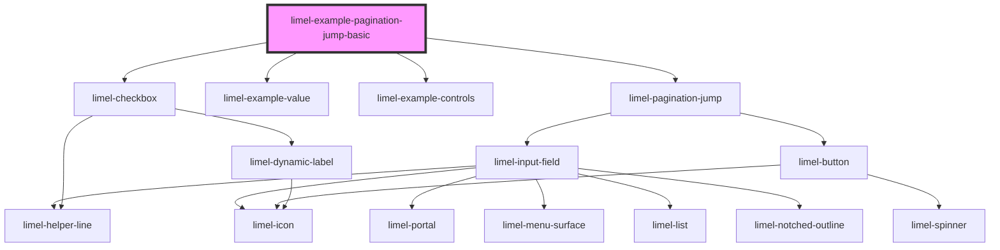

<!-- Auto Generated Below -->

## Overview

Jumping to a page

This is the form that `limel-pagination` puts inside the popover its `···`
opens. It is shown on its own here, without the popover around it, so that
what it does is easier to see.

It starts from the page the user is on, so that moving a few pages is a
keystroke or two rather than typing a number from scratch. A page beyond
either end of the set is not refused: the set has a first and a last page,
both written in the field, and the nearer of them is what someone typing
past the end meant. Try `9999` and watch where it asks to go.

Asking is all it does. It reports the page it was given and leaves showing
it to whatever is listening, the same way the pagination it belongs to
leaves moving to its consumer.

## Dependencies

### Depends on

- [limel-pagination-jump](..)
- [limel-example-value](../../../../examples)
- [limel-example-controls](../../../../examples)
- [limel-checkbox](../../../checkbox)

### Graph

----------------------------------------------

*Built with [StencilJS](https://stenciljs.com/)*
