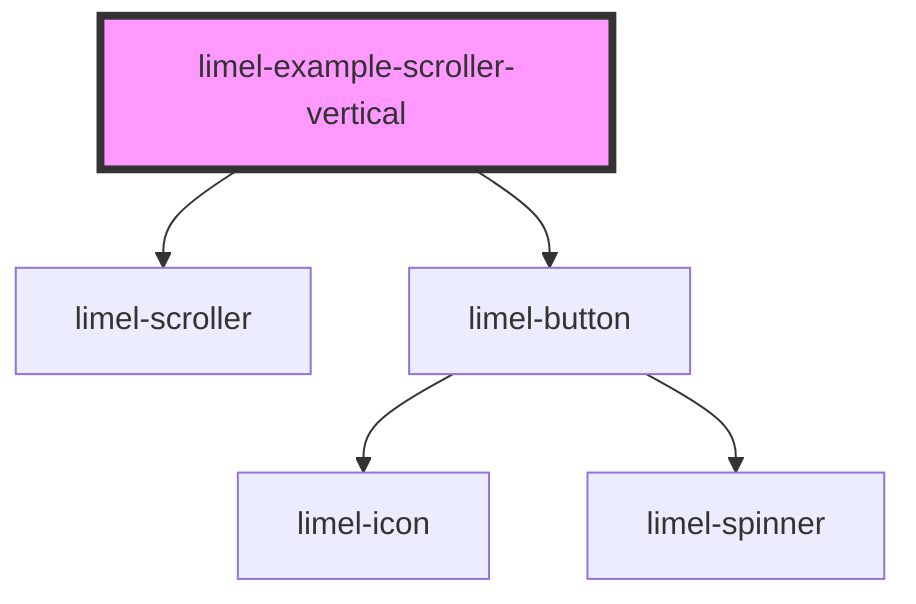

<!-- Auto Generated Below -->

## Overview

Vertical scroller
With `orientation` set to `vertical`, the content scrolls up and down, and
the arrows scroll almost a page of the available height at a time.
The scroller needs a height to scroll within. Resize the container, to see
how the scroller follows its height.

Press the Tab key to move between the buttons, and the scroller keeps the
focused one in view. As in the horizontal scroller, the arrows are only for
the mouse and touch. The Tab key skips them, and screen readers do not
announce them. The horizontal example explains why.

## Dependencies

### Depends on

- [limel-scroller](..)
- [limel-button](../../button)

### Graph

----------------------------------------------

*Built with [StencilJS](https://stenciljs.com/)*
