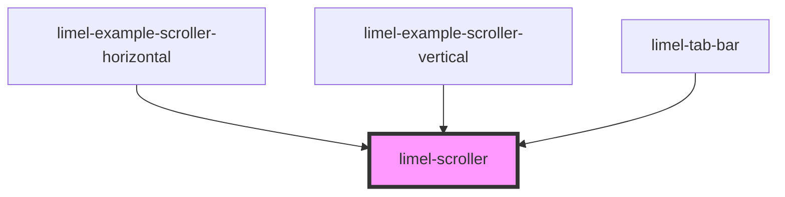

<!-- Auto Generated Below -->

## Overview

Makes content that is larger than its container scrollable, along one axis.

The native scrollbar is hidden. Instead, an edge that has more to reveal
fades out, and an arrow appears on it. Clicking the arrow scrolls almost a
page, and leaves the last part of the previous page in view, as a reference
for how far the user has scrolled. For people who have asked their system to
reduce motion, the scroller jumps instead of gliding.

When something inside the scroller receives focus, the scroller reveals the
item that holds it, together with a glimpse of whatever is next to it. An
item can control how much of its neighbors gets revealed, by setting its
`scroll-margin`. An item that becomes selected without receiving focus is up
to the consumer to reveal, using the `reveal()` method.

:::note Accessibility
The arrows are only a shortcut for people who use a mouse or a touch screen.
They are not real buttons. Screen readers do not announce them, and the Tab
key skips them. Therefore, the content must contain something that can
receive focus, such as a button, a link or a tab. Without it, there is no way
to scroll with a keyboard. The examples explain the reasoning.
:::

## Properties

| Property      | Attribute     | Description                               | Type                         | Default        |
| ------------- | ------------- | ----------------------------------------- | ---------------------------- | -------------- |
| `orientation` | `orientation` | The axis along which the content scrolls. | `"horizontal" \| "vertical"` | `'horizontal'` |

## Methods

### `reveal(item: HTMLElement, behavior?: ScrollBehavior) => Promise<void>`

Scrolls an item into view, together with a glimpse of its neighbors.
Whatever receives focus is revealed without being asked to. This is for
an item that becomes selected without receiving focus. If the scroller
is hidden, in a dialog that is closed for instance, the item is revealed
when the scroller is shown.

#### Parameters

| Name       | Type                              | Description                                                                                                              |
| ---------- | --------------------------------- | ------------------------------------------------------------------------------------------------------------------------ |
| `item`     | `HTMLElement`                     | - one of the items of the scroller, or something inside one                                                              |
| `behavior` | `"auto" \| "instant" \| "smooth"` | - `auto` jumps to the item, and `smooth` glides there. Defaults to `smooth`, unless the user has asked to reduce motion. |

#### Returns

Type: `Promise<void>`

## Slots

| Slot | Description                                              |
| ---- | -------------------------------------------------------- |
|      | The content to scroll. Each child is treated as an item. |

## Dependencies

### Used by

 - [limel-example-scroller-horizontal](examples)
 - [limel-example-scroller-vertical](examples)
 - [limel-tab-bar](../tab-bar)

### Graph

----------------------------------------------

*Built with [StencilJS](https://stenciljs.com/)*
