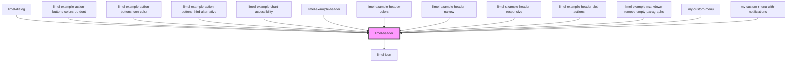

# limel-header

<!-- Auto Generated Below -->

## Overview

A header is the top most visual element in a component, page, card, or a view.

## Usage
A header is the first thing that clarifies a context for users.
Due to their positions in the UI hierarchy, headers are the most
prominent elements of a user interface; and because of that, they carry both
vital information and fundamental controls for the area of the interface
they represent.

For example, when a header is placed on top of a card, it should quickly
explain the card to the user. When placed on top of a modal, it should easily
clarify what the modal is about. When displayed on top of a fullscreen view,
it should indicate where in the system users are, and what part of the app
they are looking at.

## Layout
The vital information in a header is usually manifested in form of an icon,
and a heading. A subheading also could be added to provide supplementary
information. There is also a third place for displaying supplementary information
or "supporting text", which will be rendered as a part of the subheading.
Along with this information, headers can also include actions, controls, or
menus.

:::important
Such actions or menus must affect the entire section of the interface
which the header is representing. For example, a _Delete_ button on a card
header must delete that entire card and its respective contents all together,
not for example a selected item which is visible in the content of that card.
:::

:::warning
Do not user background color on icons in the headers. It is much better and
much easier for the eye if your icon itself has a color.
Background colors behind icons make them look like "call to action" buttons
and take a lot of attention from users.
:::

## Properties

| Property            | Attribute            | Description                                                                                                                    | Type             | Default     |
| ------------------- | -------------------- | ------------------------------------------------------------------------------------------------------------------------------ | ---------------- | ----------- |
| `heading`           | `heading`            | Title to display                                                                                                               | `string`         | `undefined` |
| `icon`              | `icon`               | Icon to display                                                                                                                | `Icon \| string` | `undefined` |
| `subheading`        | `subheading`         | Subheading to display                                                                                                          | `string`         | `undefined` |
| `subheadingDivider` | `subheading-divider` | The visual divider that separates the `subheading` and the `supportingText`. It must be a single character such as `-` or `,`. | `string`         | `'·'`       |
| `supportingText`    | `supporting-text`    | An extra string of text to display along with with the Subheading                                                              | `string`         | `undefined` |

## Slots

| Slot          | Description                                                                                                                                                                                                                                                          |
| ------------- | -------------------------------------------------------------------------------------------------------------------------------------------------------------------------------------------------------------------------------------------------------------------- |
| `"[no name]"` | DEPRECATED. The `actions` slot used to be unnamed. This behavior has been deprecated, and support will be dropped in a future version. Please add `slot="actions"` to your elements to ensure your code will continue to work with future versions of Lime Elements. |
| `"actions"`   | Content (actions) to be put inside the far right surface of the header                                                                                                                                                                                               |

## Dependencies

### Used by

 - [limel-dialog](../dialog)
 - [limel-example-action-buttons-colors-do-dont](../../design-guidelines/action-buttons/examples)
 - [limel-example-action-buttons-icon-color](../../design-guidelines/action-buttons/examples)
 - [limel-example-action-buttons-third-alternative](../../design-guidelines/action-buttons/examples)
 - [limel-example-chart-accessibility](../chart/examples)
 - [limel-example-header](examples)
 - [limel-example-header-colors](examples)
 - [limel-example-header-narrow](examples)
 - [limel-example-header-responsive](examples)
 - [limel-example-header-slot-actions](examples)
 - [limel-example-markdown-remove-empty-paragraphs](../markdown/examples)
 - [my-custom-menu](../dock/examples)
 - [my-custom-menu-with-notifications](../dock/examples)

### Depends on

- [limel-icon](../icon)

### Graph

----------------------------------------------

*Built with [StencilJS](https://stenciljs.com/)*
