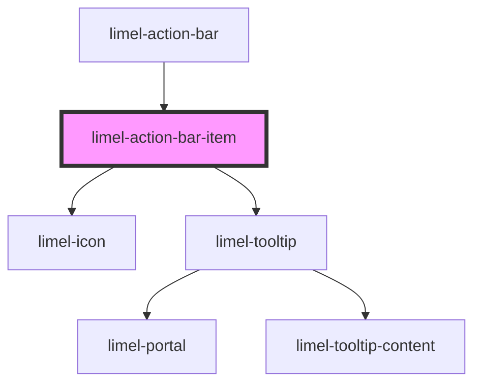

<!-- Auto Generated Below -->

## Properties

| Property            | Attribute    | Description                                                              | Type                                                                         | Default     |
| ------------------- | ------------ | ------------------------------------------------------------------------ | ---------------------------------------------------------------------------- | ----------- |
| `isVisible`         | `is-visible` | When the item is displayed in the available width, this will be `false`. | `boolean`                                                                    | `true`      |
| `item` _(required)_ | `item`       | Item that is placed in the action bar.                                   | `ActionBarItemOnlyIcon<any> \| ActionBarItemWithLabel<any> \| ListSeparator` | `undefined` |
| `selected`          | `selected`   | When the item is selected, this will be `true`.                          | `boolean`                                                                    | `false`     |

## Events

| Event    | Description                                    | Type                                                                                      |
| -------- | ---------------------------------------------- | ----------------------------------------------------------------------------------------- |
| `select` | Fired when a action bar item has been clicked. | `CustomEvent<ActionBarItemOnlyIcon<any> \| ActionBarItemWithLabel<any> \| ListSeparator>` |

## Dependencies

### Used by

 - [limel-action-bar](..)

### Depends on

- [limel-icon](../../icon)
- [limel-tooltip](../../tooltip)

### Graph

----------------------------------------------

*Built with [StencilJS](https://stenciljs.com/)*
