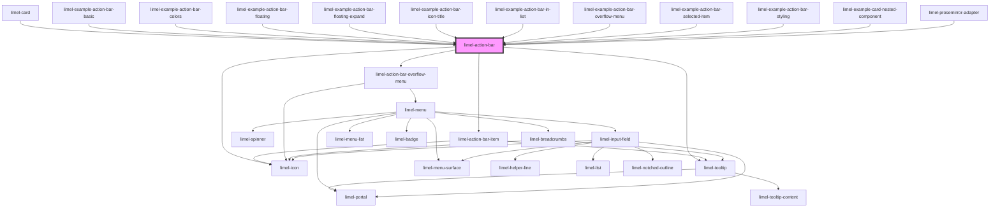

<!-- Auto Generated Below -->

## Overview

An action bar is a user interface element commonly found in software applications and websites.
It typically appears at the top of the screen or within a specific section
and serves as a centralized hub for accessing various actions and commands
relevant to the current context or page.

The action bar often contains a set of clickable icons or buttons (icons + labels)
that represent specific actions, such as saving, deleting, editing, sharing,
or bulk operations for selected items.

The purpose of an action bar is to provide quick and convenient access to
frequently used functionalities, enabling users to perform common tasks efficiently.
It enhances usability by organizing important actions in a visually prominent and easily accessible location.

The action bar's design and layout can vary based on the platform or application,
but its primary goal remains consistent—to
empower users to interact with the software and perform desired actions effortlessly.

## Properties

| Property          | Attribute          | Description                                                                                                                                                                                                                                                                                                                                                | Type                                                                                                                                                                 | Default                                      |
| ----------------- | ------------------ | ---------------------------------------------------------------------------------------------------------------------------------------------------------------------------------------------------------------------------------------------------------------------------------------------------------------------------------------------------------- | -------------------------------------------------------------------------------------------------------------------------------------------------------------------- | -------------------------------------------- |
| `accessibleLabel` | `accessible-label` | A label used to describe the purpose of the element to users of assistive technologies, like screen readers. Example value: "toolbar"                                                                                                                                                                                                                      | `string`                                                                                                                                                             | `undefined`                                  |
| `actions`         | --                 | Items that are placed in the action bar. These represent primary actions.                                                                                                                                                                                                                                                                                  | `(ListSeparator \| ActionBarItem)[]`                                                                                                                                 | `[]`                                         |
| `collapsible`     | `collapsible`      | When set to `true`, the action bar will be collapsible.                                                                                                                                                                                                                                                                                                    | `boolean`                                                                                                                                                            | `false`                                      |
| `language`        | `language`         | Defines the language for translations.                                                                                                                                                                                                                                                                                                                     | `"da" \| "de" \| "en" \| "fi" \| "fr" \| "nb" \| "nl" \| "no" \| "sv"`                                                                                               | `document.documentElement.lang as Languages` |
| `layout`          | `layout`           | - When set to `fullWidth`, the component will take the entire width of its container. - When set to `floating`, the component will get basic stylings to visualize the floating state. :::note You should still properly position the component according to the structure of your user interface. For example, use an `absolute` or `fixed` position. ::: | `"floating" \| "fullWidth"`                                                                                                                                          | `undefined`                                  |
| `openDirection`   | `open-direction`   | Defines the location that the content of the overflow menu appears, in relation to its trigger.                                                                                                                                                                                                                                                            | `"bottom" \| "bottom-end" \| "bottom-start" \| "left" \| "left-end" \| "left-start" \| "right" \| "right-end" \| "right-start" \| "top" \| "top-end" \| "top-start"` | `undefined`                                  |

## Events

| Event          | Description                                    | Type                                                                     |
| -------------- | ---------------------------------------------- | ------------------------------------------------------------------------ |
| `itemSelected` | Fired when a action bar item has been clicked. | `CustomEvent<ActionBarItemOnlyIcon<any> \| ActionBarItemWithLabel<any>>` |

## Dependencies

### Used by

 - [limel-card](../card)
 - [limel-example-action-bar-basic](examples)
 - [limel-example-action-bar-colors](examples)
 - [limel-example-action-bar-floating](examples)
 - [limel-example-action-bar-floating-expand](examples)
 - [limel-example-action-bar-icon-title](examples)
 - [limel-example-action-bar-in-list](examples)
 - [limel-example-action-bar-overflow-menu](examples)
 - [limel-example-action-bar-selected-item](examples)
 - [limel-example-action-bar-styling](examples)
 - [limel-example-card-nested-component](../card/examples)
 - [limel-prosemirror-adapter](../text-editor/prosemirror-adapter)

### Depends on

- [limel-action-bar-item](action-bar-item)
- [limel-action-bar-overflow-menu](action-bar-item)
- [limel-icon](../icon)
- [limel-tooltip](../tooltip)

### Graph

----------------------------------------------

*Built with [StencilJS](https://stenciljs.com/)*
