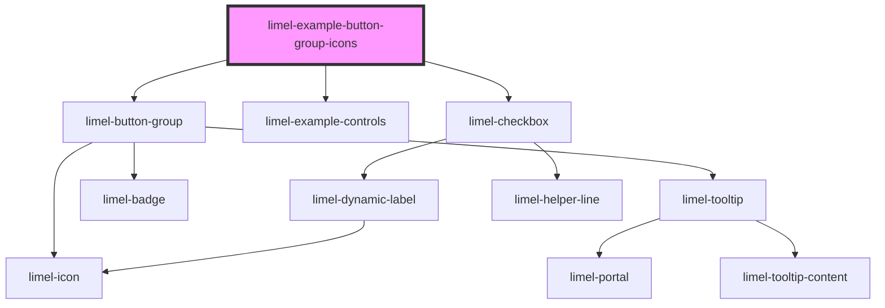

<!-- Auto Generated Below -->

## Overview

Icon only

If you pick well descriptive icons, this layout will usually suffice. When
you specify an `icon`, it will automatically be shown instead of the `title`.
:::important
Adding titles for buttons is compulsory. The reason is that when
only icons are shown, titles will appear as `aria-label` for screen readers,
as well as `title` attribute when users hover and hold their cursors on the
buttons.
:::
This makes it easier for them to know what the button actually does
or what the icon tries to indicate.

So, make sure to label your icons properly and descriptively.

## Dependencies

### Depends on

- [limel-button-group](..)
- [limel-example-controls](../../../examples)
- [limel-checkbox](../../checkbox)

### Graph

----------------------------------------------

*Built with [StencilJS](https://stenciljs.com/)*
