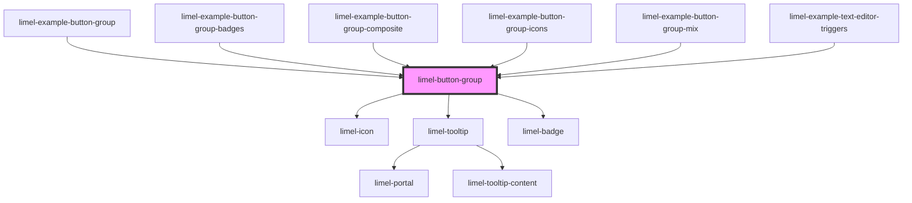

<!-- Auto Generated Below -->

## Overview

A button group control is a linear set of two or more buttons.

## Usage

Button groups are often used to display different views of the same thing. A
common example of this component is when you switch between [ Map | Transit
| Satellite ] views to look at an area on the map.

In some cases, button groups may serve as quick filters as well. For example
a list of contacts, in which the user can switch to [ All | Favorites
| Frequently contacted ] can incorporate a button group to quickly filter out
items and display subsets of them.

## Layout

The button groups are usually placed in top headers and action bars,
sometimes with other elements. Since the group items will always be rendered
in a row, you must make sure not to have too many buttons in the group.
Because if the container of your button group does not get enough space to
fit in all its buttons, they will have to truncate their text and may appear
very cramped together. Always think about how your button group will appear
on a small screen such as phones.
:::note
Button can contain text or icons, but not both simultaneously!
:::

Within the group, icon buttons will all have the same width, while each text button
inherits its width from its content.

## Properties

| Property   | Attribute  | Description                                 | Type       | Default |
| ---------- | ---------- | ------------------------------------------- | ---------- | ------- |
| `disabled` | `disabled` | True if the button-group should be disabled | `boolean`  | `false` |
| `value`    | `value`    | List of buttons for the group               | `Button[]` | `[]`    |

## Events

| Event    | Description                                     | Type                  |
| -------- | ----------------------------------------------- | --------------------- |
| `change` | Dispatched when a button is selected/deselected | `CustomEvent<Button>` |

## Dependencies

### Used by

 - [limel-example-button-group](examples)
 - [limel-example-button-group-badges](examples)
 - [limel-example-button-group-composite](examples)
 - [limel-example-button-group-icons](examples)
 - [limel-example-button-group-mix](examples)
 - [limel-example-text-editor-triggers](../text-editor/examples)

### Depends on

- [limel-icon](../icon)
- [limel-tooltip](../tooltip)
- [limel-badge](../badge)

### Graph

----------------------------------------------

*Built with [StencilJS](https://stenciljs.com/)*
