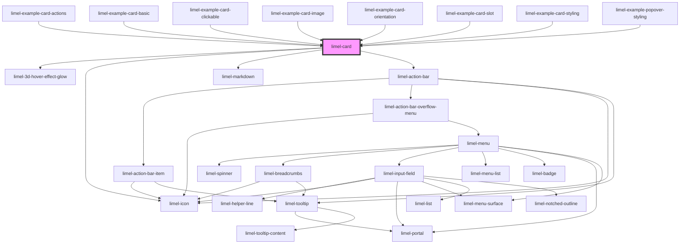

<!-- Auto Generated Below -->

## Overview

Card is a component that displays content about a single topic,
in a structured way. It can contain a header, and some supporting media such
as an image or an icon, a body of text, or optional actions.

## Properties

| Property      | Attribute     | Description                                                                                                     | Type                                 | Default      |
| ------------- | ------------- | --------------------------------------------------------------------------------------------------------------- | ------------------------------------ | ------------ |
| `actions`     | `actions`     | Actions to display in the card, to provide the user with options to interact with the content.                  | `(ListSeparator \| ActionBarItem)[]` | `[]`         |
| `clickable`   | `clickable`   | When true, improve the accessibility of the component and hints the user that the card can be interacted width. | `boolean`                            | `false`      |
| `heading`     | `heading`     | Heading of the card, to provide a short title about the context.                                                | `string`                             | `undefined`  |
| `icon`        | `icon`        | An icon, to display along with the heading and subheading.                                                      | `Icon \| string`                     | `undefined`  |
| `image`       | `image`       | A hero image to display in the card, to enrich the content with visual information.                             | `Image`                              | `undefined`  |
| `orientation` | `orientation` | The orientation of the card, specially useful when the card has an image.                                       | `"landscape" \| "portrait"`          | `'portrait'` |
| `subheading`  | `subheading`  | Subheading of the card to provide a short description of the context.                                           | `string`                             | `undefined`  |
| `value`       | `value`       | The content of the card. Supports markdown, to provide a rich text experience.                                  | `string`                             | `undefined`  |

## Events

| Event            | Description                                    | Type                                                                     |
| ---------------- | ---------------------------------------------- | ------------------------------------------------------------------------ |
| `actionSelected` | Fired when a action bar item has been clicked. | `CustomEvent<ActionBarItemOnlyIcon<any> \| ActionBarItemWithLabel<any>>` |

## Dependencies

### Used by

 - [limel-example-card-actions](examples)
 - [limel-example-card-basic](examples)
 - [limel-example-card-clickable](examples)
 - [limel-example-card-image](examples)
 - [limel-example-card-orientation](examples)
 - [limel-example-card-slot](examples)
 - [limel-example-card-styling](examples)
 - [limel-example-popover-styling](../popover/examples)

### Depends on

- [limel-3d-hover-effect-glow](../3d-hover-effect-glow)
- [limel-icon](../icon)
- [limel-markdown](../markdown)
- [limel-action-bar](../action-bar)

### Graph

----------------------------------------------

*Built with [StencilJS](https://stenciljs.com/)*
