<!-- Auto Generated Below -->

## Overview

A chart is a graphical representation of data, in which
visual symbols such as such bars, dots, lines, or slices, represent
each data point, in comparison to others.

## Properties

| Property                | Attribute                 | Description                                                                                                                                                                                                   | Type                                                                                            | Default         |
| ----------------------- | ------------------------- | ------------------------------------------------------------------------------------------------------------------------------------------------------------------------------------------------------------- | ----------------------------------------------------------------------------------------------- | --------------- |
| `accessibleItemsLabel`  | `accessible-items-label`  | Helps users of assistive technologies to understand what the items in the chart represent. Defaults to the translation for "items" in the current language.                                                   | `string`                                                                                        | `undefined`     |
| `accessibleLabel`       | `accessible-label`        | Helps users of assistive technologies to understand the context of the chart, and what is being displayed.                                                                                                    | `string`                                                                                        | `undefined`     |
| `accessibleValuesLabel` | `accessible-values-label` | Helps users of assistive technologies to understand what the values in the chart represent. Defaults to the translation for "value" in the current language.                                                  | `string`                                                                                        | `undefined`     |
| `axisIncrement`         | `axis-increment`          | Specifies the increment for the axis lines.                                                                                                                                                                   | `number`                                                                                        | `undefined`     |
| `displayAxisLabels`     | `display-axis-labels`     | When set to true, renders visible labels for X and Y axes. Only affects chart types with X and Y axes, such as area, bar, and line charts.                                                                    | `boolean`                                                                                       | `false`         |
| `items` _(required)_    | --                        | List of items in the chart, each representing a data point.                                                                                                                                                   | `ChartItem<number \| [number, number]>[]`                                                       | `undefined`     |
| `language`              | `language`                | Defines the language for translations. Will translate the translatable strings on the components.                                                                                                             | `"da" \| "de" \| "en" \| "fi" \| "fr" \| "nb" \| "nl" \| "no" \| "sv"`                          | `'en'`          |
| `loading`               | `loading`                 | Indicates whether the chart is in a loading state.                                                                                                                                                            | `boolean`                                                                                       | `false`         |
| `maxValue`              | `max-value`               | Specifies the range that items' values could be in. This is used in calculation of the size of the items in the chart. When not provided, the sum of all values in the items will be considered as the range. | `number`                                                                                        | `undefined`     |
| `orientation`           | `orientation`             | Defines whether the chart is intended to be displayed wide or tall. Does not have any effect on chart types which generate circular forms.                                                                    | `"landscape" \| "portrait"`                                                                     | `'landscape'`   |
| `type`                  | `type`                    | Defines how items are visualized in the chart.                                                                                                                                                                | `"area" \| "bar" \| "dot" \| "doughnut" \| "line" \| "nps" \| "pie" \| "ring" \| "stacked-bar"` | `'stacked-bar'` |

## Events

| Event      | Description                                                       | Type                                                 |
| ---------- | ----------------------------------------------------------------- | ---------------------------------------------------- |
| `interact` | Fired when a chart item with `clickable` set to `true` is clicked | `CustomEvent<ChartItem<number \| [number, number]>>` |

## Dependencies

### Used by

 - [limel-example-chart-accessibility](examples)
 - [limel-example-chart-axis-increment](examples)
 - [limel-example-chart-axis-labels](examples)
 - [limel-example-chart-clickable-items](examples)
 - [limel-example-chart-creative-styling](examples)
 - [limel-example-chart-max-value](examples)
 - [limel-example-chart-multi-axis](examples)
 - [limel-example-chart-multi-axis-area-with-negative-start-values](examples)
 - [limel-example-chart-multi-axis-with-negative-start-values](examples)
 - [limel-example-chart-orientation](examples)
 - [limel-example-chart-stacked-bar](examples)
 - [limel-example-chart-styling](examples)
 - [limel-example-chart-type-area](examples)
 - [limel-example-chart-type-bar](examples)
 - [limel-example-chart-type-dot](examples)
 - [limel-example-chart-type-doughnut](examples)
 - [limel-example-chart-type-gantt](examples)
 - [limel-example-chart-type-line](examples)
 - [limel-example-chart-type-nps](examples)
 - [limel-example-chart-type-pie](examples)
 - [limel-example-chart-type-ring](examples)
 - [limel-example-info-tile-primary-slot](../info-tile/examples)

### Depends on

- [limel-spinner](../spinner)
- [limel-badge](../badge)
- [limel-tooltip](../tooltip)

### Graph

```mermaid
graph TD;
  limel-chart --> limel-spinner
  limel-chart --> limel-badge
  limel-chart --> limel-tooltip
  limel-tooltip --> limel-portal
  limel-tooltip --> limel-tooltip-content
  limel-example-chart-accessibility --> limel-chart
  limel-example-chart-axis-increment --> limel-chart
  limel-example-chart-axis-labels --> limel-chart
  limel-example-chart-clickable-items --> limel-chart
  limel-example-chart-creative-styling --> limel-chart
  limel-example-chart-max-value --> limel-chart
  limel-example-chart-multi-axis --> limel-chart
  limel-example-chart-multi-axis-area-with-negative-start-values --> limel-chart
  limel-example-chart-multi-axis-with-negative-start-values --> limel-chart
  limel-example-chart-orientation --> limel-chart
  limel-example-chart-stacked-bar --> limel-chart
  limel-example-chart-styling --> limel-chart
  limel-example-chart-type-area --> limel-chart
  limel-example-chart-type-bar --> limel-chart
  limel-example-chart-type-dot --> limel-chart
  limel-example-chart-type-doughnut --> limel-chart
  limel-example-chart-type-gantt --> limel-chart
  limel-example-chart-type-line --> limel-chart
  limel-example-chart-type-nps --> limel-chart
  limel-example-chart-type-pie --> limel-chart
  limel-example-chart-type-ring --> limel-chart
  limel-example-info-tile-primary-slot --> limel-chart
  style limel-chart fill:#f9f,stroke:#333,stroke-width:4px
```

----------------------------------------------

*Built with [StencilJS](https://stenciljs.com/)*
