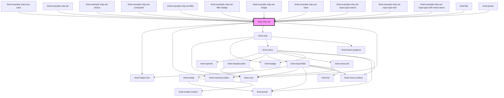

<!-- Auto Generated Below -->


## Overview

:::note
**Regarding `click` and `interact` events:**

The `interact` event is emitted when a chip is interacted with, and is
the recommended way to listen for chip interactions.

However, if you need to handle clicks differently depending on which chip
was clicked, or whether the click was on a chip or elsewhere, you need to
listen to the native `click` event instead.

Native `click` events are passed through, and if the click came from
a chip, the chip object is available in the event object under
`<event object>.Lime.chip`.

Example usage:
```ts
private handleClick(event: Event) {
    if (event && 'Lime' in event && (event.Lime as any).chip) {
        if ((event.Lime as { chip: Chip }).chip.href) {
            // Chip has href, so let the browser open the link.
            return;
        }
        // handle click on chip without href
    } else {
        // handle click elsewhere
    }
}
```
:::

## Properties

| Property           | Attribute             | Description                                                                                                                                                                                                                                                                                                                                                                             | Type                                                                   | Default     |
| ------------------ | --------------------- | --------------------------------------------------------------------------------------------------------------------------------------------------------------------------------------------------------------------------------------------------------------------------------------------------------------------------------------------------------------------------------------- | ---------------------------------------------------------------------- | ----------- |
| `autocomplete`     | `autocomplete`        | For chip-set of type `input`, defines whether the input field should have autocomplete enabled. Read more about the `autocomplete` attribute [here](https://developer.mozilla.org/en-US/docs/Web/HTML/Attributes/autocomplete).                                                                                                                                                         | `string`                                                               | `'off'`     |
| `clearAllButton`   | `clear-all-button`    | Whether the "Clear all" buttons should be shown                                                                                                                                                                                                                                                                                                                                         | `boolean`                                                              | `true`      |
| `delimiter`        | `delimiter`           | For chip-set of type `input`. Sets delimiters between chips.                                                                                                                                                                                                                                                                                                                            | `string`                                                               | `null`      |
| `disabled`         | `disabled`            | True if the chip set should be disabled                                                                                                                                                                                                                                                                                                                                                 | `boolean`                                                              | `false`     |
| `emptyInputOnBlur` | `empty-input-on-blur` | Whether the input field should be emptied when the chip-set loses focus.                                                                                                                                                                                                                                                                                                                | `boolean`                                                              | `true`      |
| `helperText`       | `helper-text`         | Optional helper text to display below the chipset. When type is `input`, the helper text is displayed below the input field when it has focus. When type is not `input`, the helper text is always displayed if the device is touch screen; otherwise it is shown when chip-set is hovered or focused using keyboard navigation.                                                        | `string`                                                               | `undefined` |
| `inputType`        | `input-type`          | For chip-sets of type `input`. Value to use for the `type` attribute on the input field inside the chip-set.                                                                                                                                                                                                                                                                            | `"search" \| "text"`                                                   | `'text'`    |
| `invalid`          | `invalid`             | Set to `true` to indicate that the current value of the input field is invalid.                                                                                                                                                                                                                                                                                                         | `boolean`                                                              | `false`     |
| `label`            | `label`               | Label for the chip-set                                                                                                                                                                                                                                                                                                                                                                  | `string`                                                               | `undefined` |
| `language`         | `language`            | Defines the language for translations. Will translate the translatable strings on the components. For example, the clear all chips label.                                                                                                                                                                                                                                               | `"da" \| "de" \| "en" \| "fi" \| "fr" \| "nb" \| "nl" \| "no" \| "sv"` | `'en'`      |
| `leadingIcon`      | `leading-icon`        | For chip-sets of type `input`. When the value is null, no leading icon is used. Leading icon to show to the far left in the text field                                                                                                                                                                                                                                                  | `string`                                                               | `null`      |
| `maxItems`         | `max-items`           | For chip-sets of type `input`. Limits the maximum number of chips. When the value is `0` or not set, no limit is applied.                                                                                                                                                                                                                                                               | `number`                                                               | `undefined` |
| `readonly`         | `readonly`            | For chip-sets of type `input`, set to `true` to disable adding and removing chips, but allow interaction with existing chips in the set. For any other types, setting either `readonly` or `disabled` disables the chip-set.                                                                                                                                                            | `boolean`                                                              | `false`     |
| `required`         | `required`            | True if the control requires a value                                                                                                                                                                                                                                                                                                                                                    | `boolean`                                                              | `false`     |
| `searchLabel`      | `search-label`        | Search label to display when type is `input` and component is in search mode                                                                                                                                                                                                                                                                                                            | `string`                                                               | `undefined` |
| `type`             | `type`                | Type of chip set  - `choice` renders a set of selectable chips where only one is selectable. The `removable` property is ignored - `filter` renders a set of selectable chips where all are selectable. - `input` renders a set of chips that can be used in conjunction with an input field  If no type is set, a basic set of chips without additional functionality will be rendered | `"choice" \| "filter" \| "input"`                                      | `undefined` |
| `value`            | `value`               | List of chips for the set                                                                                                                                                                                                                                                                                                                                                               | `Chip<any>[]`                                                          | `[]`        |


## Events

| Event       | Description                                                                                 | Type                                    |
| ----------- | ------------------------------------------------------------------------------------------- | --------------------------------------- |
| `change`    | Dispatched when a chip is selected/deselected                                               | `CustomEvent<Chip<any> \| Chip<any>[]>` |
| `input`     | Dispatched when the input is changed for type `input`                                       | `CustomEvent<string>`                   |
| `interact`  | Dispatched when a chip is interacted with                                                   | `CustomEvent<Chip<any>>`                |
| `startEdit` | Emitted when an input chip set has received focus and editing in the text field has started | `CustomEvent<void>`                     |
| `stopEdit`  | Emitted when an input chip set has lost focus and editing in the text field has ended       | `CustomEvent<void>`                     |


## Methods

### `emptyInput() => Promise<void>`

Used to empty the input field. Used in conjunction with `emptyInputOnBlur` to let the
consumer control when the input is emptied.

#### Returns

Type: `Promise<void>`

does not return anything, but methods have to be async

### `getEditMode() => Promise<boolean>`

Used to find out whether the chip-set is in edit mode.

#### Returns

Type: `Promise<boolean>`

`true` if the chip-set is in edit mode, `false` otherwise.

### `setFocus(emptyInput?: boolean) => Promise<void>`

Used to set focus to the chip-set input field.

#### Parameters

| Name         | Type      | Description                                     |
| ------------ | --------- | ----------------------------------------------- |
| `emptyInput` | `boolean` | - if `true`, any text in the input is discarded |

#### Returns

Type: `Promise<void>`

does not return anything, but methods have to be async


## Dependencies

### Used by

 - [limel-example-chip-icon-color](examples)
 - [limel-example-chip-set](examples)
 - [limel-example-chip-set-choice](examples)
 - [limel-example-chip-set-composite](examples)
 - [limel-example-chip-set-filter](examples)
 - [limel-example-chip-set-filter-badge](examples)
 - [limel-example-chip-set-image](examples)
 - [limel-example-chip-set-input](examples)
 - [limel-example-chip-set-input-type-search](examples)
 - [limel-example-chip-set-input-type-text](examples)
 - [limel-example-chip-set-input-type-with-menu-items](examples)
 - [limel-file](../file)
 - [limel-picker](../picker)

### Depends on

- [limel-helper-line](../helper-line)
- [limel-notched-outline](../notched-outline)
- [limel-chip](../chip)
- [limel-icon](../icon)

### Graph


----------------------------------------------

*Built with [StencilJS](https://stenciljs.com/)*
