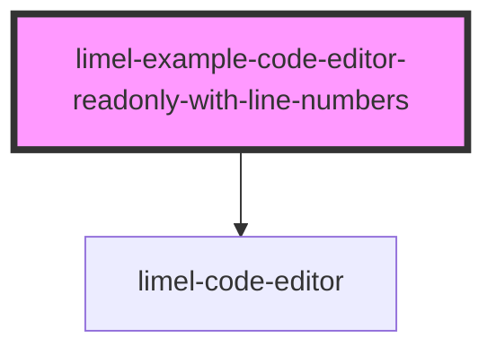

<!-- Auto Generated Below -->

## Overview

Readonly, with line numbers and dark theme
Here you see a `readonly` instance of the Code Editor component. This means
you cannot edit the code. We also display line numbers here.
Additionally, this instance has a `dark` `colorScheme`, which means it does not
respect the operating system's settings for preferred appearance (dark or light).

## Dependencies

### Depends on

- [limel-code-editor](..)

### Graph

----------------------------------------------

*Built with [StencilJS](https://stenciljs.com/)*
