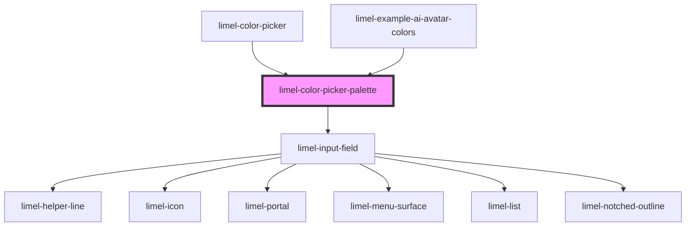

<!-- Auto Generated Below -->

## Properties

| Property      | Attribute      | Description                                                                                                                      | Type                              | Default     |
| ------------- | -------------- | -------------------------------------------------------------------------------------------------------------------------------- | --------------------------------- | ----------- |
| `columnCount` | `column-count` | Defines the number of columns in the color swatch grid. If not provided, it will default to the number of colors in the palette. | `number`                          | `undefined` |
| `helperText`  | `helper-text`  | Helper text of the input field                                                                                                   | `string`                          | `undefined` |
| `invalid`     | `invalid`      | Set to `true` to indicate that the current value of the input field is invalid.                                                  | `boolean`                         | `false`     |
| `label`       | `label`        | Label of the input field                                                                                                         | `string`                          | `undefined` |
| `manualInput` | `manual-input` | Set to `false` to disallow custom color values to be typed into the input field.                                                 | `boolean`                         | `true`      |
| `palette`     | `palette`      | Custom color palette to use instead of Lime palette. Internal prop passed from parent.                                           | `(string \| CustomColorSwatch)[]` | `undefined` |
| `placeholder` | `placeholder`  | The placeholder text shown inside the input field, when the field is focused and empty.                                          | `string`                          | `undefined` |
| `required`    | `required`     | Set to `true` if a value is required                                                                                             | `boolean`                         | `undefined` |
| `value`       | `value`        | Color value that is manually typed by the user                                                                                   | `string`                          | `undefined` |

## Events

| Event    | Description                                | Type                  |
| -------- | ------------------------------------------ | --------------------- |
| `change` | Emits chosen value to the parent component | `CustomEvent<string>` |

## Dependencies

### Used by

 - [limel-color-picker](.)
 - [limel-example-ai-avatar-colors](../ai-avatar/examples)

### Depends on

- [limel-input-field](../input-field)

### Graph

----------------------------------------------

*Built with [StencilJS](https://stenciljs.com/)*
