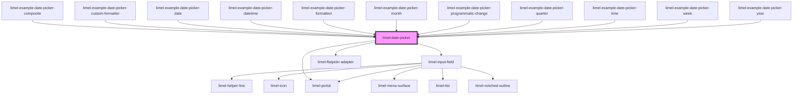

<!-- Auto Generated Below -->

## Properties

| Property      | Attribute     | Description                                                                                                                                                                                                                             | Type                                                                         | Default      |
| ------------- | ------------- | --------------------------------------------------------------------------------------------------------------------------------------------------------------------------------------------------------------------------------------- | ---------------------------------------------------------------------------- | ------------ |
| `disabled`    | `disabled`    | Set to `true` to disable the field. Use `disabled` to indicate that the field can normally be interacted with, but is currently disabled. This tells the user that if certain requirements are met, the field may become enabled again. | `boolean`                                                                    | `false`      |
| `format`      | `format`      | Format to display the selected date in.                                                                                                                                                                                                 | `string`                                                                     | `undefined`  |
| `formatter`   | `formatter`   | Custom formatting function. Will be used for date formatting.  :::note overrides `format` and `language` :::                                                                                                                            | `(date: Date) => string`                                                     | `undefined`  |
| `helperText`  | `helper-text` | Optional helper text to display below the input field when it has focus                                                                                                                                                                 | `string`                                                                     | `undefined`  |
| `invalid`     | `invalid`     | Set to `true` to indicate that the current value of the date picker is invalid.                                                                                                                                                         | `boolean`                                                                    | `false`      |
| `label`       | `label`       | Text to display next to the date picker                                                                                                                                                                                                 | `string`                                                                     | `undefined`  |
| `language`    | `language`    | Defines the localisation for translations and date formatting. Property `format` customizes the localized date format.                                                                                                                  | `"da" \| "de" \| "en" \| "fi" \| "fr" \| "nb" \| "nl" \| "no" \| "sv"`       | `'en'`       |
| `placeholder` | `placeholder` | The placeholder text shown inside the input field, when the field is focused and empty                                                                                                                                                  | `string`                                                                     | `undefined`  |
| `readonly`    | `readonly`    | Set to `true` to make the field read-only. Use `readonly` when the field is only there to present the data it holds, and will not become possible for the current user to edit.                                                         | `boolean`                                                                    | `false`      |
| `required`    | `required`    | Set to `true` to indicate that the field is required.                                                                                                                                                                                   | `boolean`                                                                    | `false`      |
| `type`        | `type`        | Type of date picker.                                                                                                                                                                                                                    | `"date" \| "datetime" \| "month" \| "quarter" \| "time" \| "week" \| "year"` | `'datetime'` |
| `value`       | `value`       | The value of the field.                                                                                                                                                                                                                 | `Date`                                                                       | `undefined`  |

## Events

| Event    | Description                                    | Type                |
| -------- | ---------------------------------------------- | ------------------- |
| `change` | Emitted when the date picker value is changed. | `CustomEvent<Date>` |

## Dependencies

### Used by

 - [limel-example-date-picker-composite](examples)
 - [limel-example-date-picker-custom-formatter](examples)
 - [limel-example-date-picker-date](examples)
 - [limel-example-date-picker-datetime](examples)
 - [limel-example-date-picker-formatted](examples)
 - [limel-example-date-picker-month](examples)
 - [limel-example-date-picker-programmatic-change](examples)
 - [limel-example-date-picker-quarter](examples)
 - [limel-example-date-picker-time](examples)
 - [limel-example-date-picker-week](examples)
 - [limel-example-date-picker-year](examples)

### Depends on

- [limel-input-field](../input-field)
- [limel-portal](../portal)
- [limel-flatpickr-adapter](flatpickr-adapter)

### Graph

----------------------------------------------

*Built with [StencilJS](https://stenciljs.com/)*
