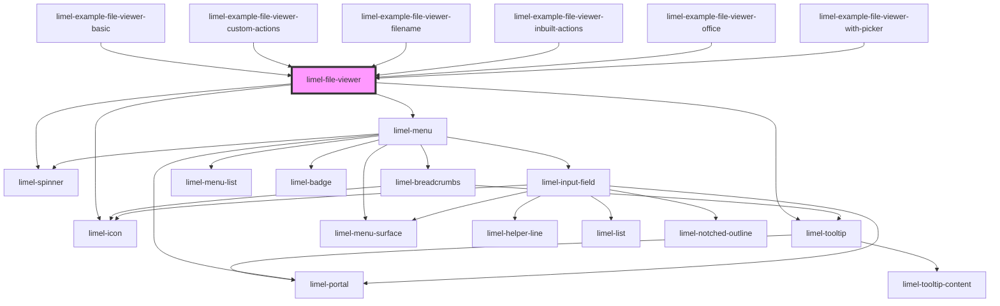

<!-- Auto Generated Below -->

## Overview

This is a smart component that automatically detects
the most common file types such as image, audio, video, and text,
and properly displays them in the browser.
The component is also capable to render the most common office files.

:::note
Image files will always be contained in their containers, which means
they automatically increase or decrease in size to fill their containing box
whilst preserving their aspect-ratio.

Text and PDF files will also always respect the width and height of the
container in which the `limel-file-viewer` is loaded.
:::

For some file types such as text and images, the component will display a
download button and a button to open the file in a new browser tab.
This will allow users to preview the file in a fullscreen mode with the
browser and take advantage of for example native zooming and panning
functionalities.

## Properties

| Property            | Attribute               | Description                                                                                                                                                                                                                                                                     | Type                                                                   | Default              |
| ------------------- | ----------------------- | ------------------------------------------------------------------------------------------------------------------------------------------------------------------------------------------------------------------------------------------------------------------------------- | ---------------------------------------------------------------------- | -------------------- |
| `actions`           | `actions`               | An array of custom actions that can be displayed as an action menu on the file which is being displayed.                                                                                                                                                                        | `ListItem<any>[]`                                                      | `undefined`          |
| `allowDownload`     | `allow-download`        | Displays a button that allows the user to download the file. Note that due to the browser's security policies, the file should be hosted on the same domain for the download button to work properly. Not displayed for office files!                                           | `boolean`                                                              | `false`              |
| `allowFullscreen`   | `allow-fullscreen`      | Displays a button that allows the user to view the file in fullscreen mode. Not displayed for office files!                                                                                                                                                                     | `boolean`                                                              | `false`              |
| `allowOpenInNewTab` | `allow-open-in-new-tab` | Displays a button that allows the user to open the file in a new browser tab. Not displayed for office files!                                                                                                                                                                   | `boolean`                                                              | `false`              |
| `alt`               | `alt`                   | An optional alternative text, mainly for assistive technologies and screen readers. It is used for only image files, as an `alt` attribute. Should optimally hold a description of the image, which is also displayed on the page if the image can't be loaded for some reason. | `string`                                                               | `undefined`          |
| `filename`          | `filename`              | The name of the file that must also contains its extension. This overrides the filename that the `url` ends with. Useful when the `url` does not contain the filename. When specified, the `filename` will be used as filename of the downloaded file.                          | `string`                                                               | `undefined`          |
| `language`          | `language`              | Defines the localization for translations.                                                                                                                                                                                                                                      | `"da" \| "de" \| "en" \| "fi" \| "fr" \| "nb" \| "nl" \| "no" \| "sv"` | `'en'`               |
| `officeViewer`      | `office-viewer`         | Defines the third-party viewer that should be used to render the content of office files, such as word processing documents, presentations, or spreadsheets.                                                                                                                    | `"google-drive" \| "microsoft-office"`                                 | `'microsoft-office'` |
| `url`               | `url`                   | Link to the file                                                                                                                                                                                                                                                                | `string`                                                               | `undefined`          |

## Events

| Event    | Description                                                    | Type                         |
| -------- | -------------------------------------------------------------- | ---------------------------- |
| `action` | Emitted when a custom action is selected from the action menu. | `CustomEvent<ListItem<any>>` |

## Dependencies

### Used by

 - [limel-example-file-viewer-basic](examples)
 - [limel-example-file-viewer-custom-actions](examples)
 - [limel-example-file-viewer-filename](examples)
 - [limel-example-file-viewer-inbuilt-actions](examples)
 - [limel-example-file-viewer-office](examples)
 - [limel-example-file-viewer-with-picker](examples)

### Depends on

- [limel-icon](../icon)
- [limel-tooltip](../tooltip)
- [limel-menu](../menu)
- [limel-spinner](../spinner)

### Graph

----------------------------------------------

*Built with [StencilJS](https://stenciljs.com/)*
