<!-- Auto Generated Below -->

## Properties

| Property          | Attribute  | Description                                                                                                                                                                                                                                                                                                                                                                                          | Type                                               | Default     |
| ----------------- | ---------- | ---------------------------------------------------------------------------------------------------------------------------------------------------------------------------------------------------------------------------------------------------------------------------------------------------------------------------------------------------------------------------------------------------- | -------------------------------------------------- | ----------- |
| `disabled`        | `disabled` | Set to `true` to disable the whole form.                                                                                                                                                                                                                                                                                                                                                             | `boolean`                                          | `false`     |
| `errors`          | --         | Extra errors to display in the form. Typical use case is asynchronous errors generated server side.                                                                                                                                                                                                                                                                                                  | `{ [key: string]: string[] \| ValidationError; }`  | `undefined` |
| `propsFactory`    | --         | Factory for creating properties for custom form components  When using custom components in the form some properties might have to be set dynamically. If this factory is set, it will be called with the current schema for the field for each custom component in the form. The factory must return an object where each key is the name of the property that should be set, along with its value. | `(schema: FormSchema<any>) => Record<string, any>` | `undefined` |
| `schema`          | --         | The schema used to render the form                                                                                                                                                                                                                                                                                                                                                                   | `FormSchema<any>`                                  | `{}`        |
| `transformErrors` | --         | Custom function to customize the default error messages                                                                                                                                                                                                                                                                                                                                              | `(errors: FormError[]) => FormError[]`             | `undefined` |
| `value`           | --         | Value of the form                                                                                                                                                                                                                                                                                                                                                                                    | `object`                                           | `undefined` |

## Events

| Event      | Description                                                                                | Type                            |
| ---------- | ------------------------------------------------------------------------------------------ | ------------------------------- |
| `change`   | Emitted when a change is made within the form                                              | `CustomEvent<object>`           |
| `validate` | Emitted when the validity of the form changes, or when a change is made to an invalid form | `CustomEvent<ValidationStatus>` |

## Dependencies

### Used by

 - [limel-example-button-group-composite](../button-group/examples)
 - [limel-example-callout-composite](../callout/examples)
 - [limel-example-chip-set-composite](../chip-set/examples)
 - [limel-example-custom-component-form](examples)
 - [limel-example-custom-error-message](examples)
 - [limel-example-date-picker-composite](../date-picker/examples)
 - [limel-example-dialog-form](../dialog/examples)
 - [limel-example-dynamic-form](examples)
 - [limel-example-file-composite](../file/examples)
 - [limel-example-form](examples)
 - [limel-example-form-array-item-controls](examples)
 - [limel-example-form-layout](examples)
 - [limel-example-form-row-layout](examples)
 - [limel-example-form-span-fields](examples)
 - [limel-example-form-with-help](examples)
 - [limel-example-list-form](examples)
 - [limel-example-menu-composite](../menu/examples)
 - [limel-example-nested-form](examples)
 - [limel-example-picker-composite](../picker/examples)
 - [limel-example-props-factory-form](examples)
 - [limel-example-server-errors](examples)
 - [limel-example-slider-composite](../slider/examples)
 - [limel-example-text-editor-as-form-component](../text-editor/examples)
 - [limel-example-tooltip-composite](../tooltip/examples)

### Depends on

- [limel-markdown](../markdown)

### Graph

```mermaid
graph TD;
  limel-form --> limel-markdown
  limel-example-button-group-composite --> limel-form
  limel-example-callout-composite --> limel-form
  limel-example-chip-set-composite --> limel-form
  limel-example-custom-component-form --> limel-form
  limel-example-custom-error-message --> limel-form
  limel-example-date-picker-composite --> limel-form
  limel-example-dialog-form --> limel-form
  limel-example-dynamic-form --> limel-form
  limel-example-file-composite --> limel-form
  limel-example-form --> limel-form
  limel-example-form-array-item-controls --> limel-form
  limel-example-form-layout --> limel-form
  limel-example-form-row-layout --> limel-form
  limel-example-form-span-fields --> limel-form
  limel-example-form-with-help --> limel-form
  limel-example-list-form --> limel-form
  limel-example-menu-composite --> limel-form
  limel-example-nested-form --> limel-form
  limel-example-picker-composite --> limel-form
  limel-example-props-factory-form --> limel-form
  limel-example-server-errors --> limel-form
  limel-example-slider-composite --> limel-form
  limel-example-text-editor-as-form-component --> limel-form
  limel-example-tooltip-composite --> limel-form
  style limel-form fill:#f9f,stroke:#333,stroke-width:4px
```

----------------------------------------------

*Built with [StencilJS](https://stenciljs.com/)*
