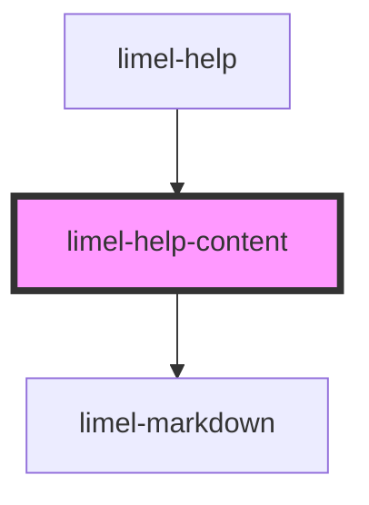

<!-- Auto Generated Below -->

## Overview

Help content
This is scrollable content that is placed in the popover of the Help component.
Moved here mostly to avoid having inlined styles in the parent component.
Since you cannot send styles to the Portal component, we need to have this
child component.

## Properties

| Property       | Attribute        | Description | Type     | Default     |
| -------------- | ---------------- | ----------- | -------- | ----------- |
| `readMoreLink` | `read-more-link` |             | `Link`   | `undefined` |
| `value`        | `value`          |             | `string` | `undefined` |

## Dependencies

### Used by

 - [limel-help](.)

### Depends on

- [limel-markdown](../markdown)

### Graph

----------------------------------------------

*Built with [StencilJS](https://stenciljs.com/)*
