<!-- Auto Generated Below -->

## Properties

| Property       | Attribute       | Description                                                                                                                                                                                                                                                                                                                                                                                                                                                   | Type                                                                                                                                                                  | Default                      |
| -------------- | --------------- | ------------------------------------------------------------------------------------------------------------------------------------------------------------------------------------------------------------------------------------------------------------------------------------------------------------------------------------------------------------------------------------------------------------------------------------------------------------- | --------------------------------------------------------------------------------------------------------------------------------------------------------------------- | ---------------------------- |
| `completions`  | `completions`   | list of suggestions `value` can autocomplete to.                                                                                                                                                                                                                                                                                                                                                                                                              | `string[]`                                                                                                                                                            | `[]`                         |
| `disabled`     | `disabled`      | Set to `true` to disable the field. Use `disabled` to indicate that the field can normally be interacted with, but is currently disabled. This tells the user that if certain requirements are met, the field may become enabled again.                                                                                                                                                                                                                       | `boolean`                                                                                                                                                             | `false`                      |
| `formatNumber` | `format-number` | Set to `true` to format the current value of the input field only if the field is of type number. The number format is determined by the current language of the browser.                                                                                                                                                                                                                                                                                     | `boolean`                                                                                                                                                             | `true`                       |
| `helperText`   | `helper-text`   | Optional helper text to display below the input field when it has focus                                                                                                                                                                                                                                                                                                                                                                                       | `string`                                                                                                                                                              | `undefined`                  |
| `invalid`      | `invalid`       | Set to `true` to indicate that the current value of the input field is invalid.                                                                                                                                                                                                                                                                                                                                                                               | `boolean`                                                                                                                                                             | `false`                      |
| `label`        | `label`         | The input label.                                                                                                                                                                                                                                                                                                                                                                                                                                              | `string`                                                                                                                                                              | `undefined`                  |
| `leadingIcon`  | `leading-icon`  | Leading icon to show to the far left in the field.                                                                                                                                                                                                                                                                                                                                                                                                            | `string`                                                                                                                                                              | `undefined`                  |
| `locale`       | `locale`        | The locale to use for formatting numbers.                                                                                                                                                                                                                                                                                                                                                                                                                     | `string`                                                                                                                                                              | `globalConfig.defaultLocale` |
| `max`          | `max`           | Maximum allowed value if input type is `number`.                                                                                                                                                                                                                                                                                                                                                                                                              | `number`                                                                                                                                                              | `undefined`                  |
| `maxlength`    | `maxlength`     | Maximum length of the value if type is `password`, `search`, `tel`, `text`, `url`, or `urlAsText`.                                                                                                                                                                                                                                                                                                                                                            | `number`                                                                                                                                                              | `undefined`                  |
| `min`          | `min`           | Minimum allowed value if input type is `number`.                                                                                                                                                                                                                                                                                                                                                                                                              | `number`                                                                                                                                                              | `undefined`                  |
| `minlength`    | `minlength`     | Minimum length of the value if type is `password`, `search`, `tel`, `text`, `url`, or `urlAsText`.                                                                                                                                                                                                                                                                                                                                                            | `number`                                                                                                                                                              | `undefined`                  |
| `pattern`      | `pattern`       | Regular expression that the current value of the input field must match. No forward slashes should be specified around the pattern. Only used if type is `text`, `tel`, `email`, `url`, `urlAsText`, `password`, or `search`.                                                                                                                                                                                                                                 | `string`                                                                                                                                                              | `undefined`                  |
| `placeholder`  | `placeholder`   | The placeholder text shown inside the input field, when the field is focused and empty.                                                                                                                                                                                                                                                                                                                                                                       | `string`                                                                                                                                                              | `undefined`                  |
| `prefix`       | `prefix`        | A short piece of text to display before the value inside the input field. Displayed for all types except `textarea`.                                                                                                                                                                                                                                                                                                                                          | `string`                                                                                                                                                              | `undefined`                  |
| `readonly`     | `readonly`      | Set to `true` to make the field read-only. Use `readonly` when the field is only there to present the data it holds, and will not become possible for the current user to edit.                                                                                                                                                                                                                                                                               | `boolean`                                                                                                                                                             | `false`                      |
| `required`     | `required`      | Set to `true` to indicate that the field is required.                                                                                                                                                                                                                                                                                                                                                                                                         | `boolean`                                                                                                                                                             | `false`                      |
| `showLink`     | `show-link`     | For inputs of type `email`, `tel`, `url`, and `urlAsText`, set this to `true` to show a trailing icon with a `mailto:`,`tel:`, or normal link, respectively. The default icon can be overridden using the `trailingIcon` property.                                                                                                                                                                                                                            | `boolean`                                                                                                                                                             | `false`                      |
| `step`         | `step`          | Incremental values that are valid if the field type is `number`.                                                                                                                                                                                                                                                                                                                                                                                              | `"any" \| number`                                                                                                                                                     | `'any'`                      |
| `suffix`       | `suffix`        | A short piece of text to display after the value inside the input field. Displayed for all types except `textarea`.                                                                                                                                                                                                                                                                                                                                           | `string`                                                                                                                                                              | `undefined`                  |
| `trailingIcon` | `trailing-icon` | Trailing icon to show to the far right in the field.                                                                                                                                                                                                                                                                                                                                                                                                          | `string`                                                                                                                                                              | `undefined`                  |
| `type`         | `type`          | Type of input.  Note** regarding type `url`: `limel-input` uses the native validation built into the browser for many types of input fields. The native validation for `url` is very strict, and does not allow relative urls, nor any other formats that are not a "fully qualified" url. To allow such urls, use the type `urlAsText` instead. `urlAsText` works exactly like `text` in all regards, except that it enables use of the `showLink` property. | `"date" \| "datetime-local" \| "email" \| "month" \| "number" \| "password" \| "search" \| "tel" \| "text" \| "textarea" \| "time" \| "url" \| "urlAsText" \| "week"` | `'text'`                     |
| `value`        | `value`         | The value of the field.                                                                                                                                                                                                                                                                                                                                                                                                                                       | `string`                                                                                                                                                              | `undefined`                  |

## Events

| Event    | Description                                                                          | Type                  |
| -------- | ------------------------------------------------------------------------------------ | --------------------- |
| `action` | Emitted when `trailingIcon` or `leadingIcon` is set and the icon is interacted with. | `CustomEvent<void>`   |
| `change` | Emitted when the input value is changed.                                             | `CustomEvent<string>` |

## Dependencies

### Used by

 - [limel-color-picker](../color-picker)
 - [limel-color-picker-palette](../color-picker)
 - [limel-date-picker](../date-picker)
 - [limel-example-button-composite](../button/examples)
 - [limel-example-chart-axis-increment](../chart/examples)
 - [limel-example-chart-type-area](../chart/examples)
 - [limel-example-chart-type-bar](../chart/examples)
 - [limel-example-chart-type-dot](../chart/examples)
 - [limel-example-chart-type-doughnut](../chart/examples)
 - [limel-example-chart-type-gantt](../chart/examples)
 - [limel-example-chart-type-line](../chart/examples)
 - [limel-example-chart-type-pie](../chart/examples)
 - [limel-example-chart-type-ring](../chart/examples)
 - [limel-example-chip-set-input](../chip-set/examples)
 - [limel-example-circular-progress](../circular-progress/examples)
 - [limel-example-circular-progress-percentage-colors](../circular-progress/examples)
 - [limel-example-collapsible-section-invalid](../collapsible-section/examples)
 - [limel-example-color-picker-composite](../color-picker/examples)
 - [limel-example-dialog-heading](../dialog/examples)
 - [limel-example-file-dropzone-type-filtering](../file-dropzone/examples)
 - [limel-example-info-tile-progress](../info-tile/examples)
 - [limel-example-input-field-autocomplete](examples)
 - [limel-example-input-field-error-icon](examples)
 - [limel-example-input-field-focus](examples)
 - [limel-example-input-field-icon-both](examples)
 - [limel-example-input-field-icon-leading](examples)
 - [limel-example-input-field-icon-trailing](examples)
 - [limel-example-input-field-number](examples)
 - [limel-example-input-field-pattern](examples)
 - [limel-example-input-field-placeholder](examples)
 - [limel-example-input-field-prefix](examples)
 - [limel-example-input-field-search](examples)
 - [limel-example-input-field-showlink](examples)
 - [limel-example-input-field-suffix](examples)
 - [limel-example-input-field-text](examples)
 - [limel-example-input-field-text-decluttering-guidelines](../../design-guidelines/declutter/examples)
 - [limel-example-input-field-text-multiple](examples)
 - [limel-example-input-field-textarea](examples)
 - [limel-example-linear-progress](../linear-progress/examples)
 - [limel-example-markdown-composite](../markdown/examples)
 - [limel-example-text-editor-composite](../text-editor/examples)
 - [limel-menu](../menu)
 - [limel-text-editor-link-menu](../text-editor/link-menu)

### Depends on

- [limel-helper-line](../helper-line)
- [limel-icon](../icon)
- [limel-portal](../portal)
- [limel-menu-surface](../menu-surface)
- [limel-list](../list)
- [limel-notched-outline](../notched-outline)

### Graph

```mermaid
graph TD;
  limel-input-field --> limel-helper-line
  limel-input-field --> limel-icon
  limel-input-field --> limel-portal
  limel-input-field --> limel-menu-surface
  limel-input-field --> limel-list
  limel-input-field --> limel-notched-outline
  limel-color-picker --> limel-input-field
  limel-color-picker-palette --> limel-input-field
  limel-date-picker --> limel-input-field
  limel-example-button-composite --> limel-input-field
  limel-example-chart-axis-increment --> limel-input-field
  limel-example-chart-type-area --> limel-input-field
  limel-example-chart-type-bar --> limel-input-field
  limel-example-chart-type-dot --> limel-input-field
  limel-example-chart-type-doughnut --> limel-input-field
  limel-example-chart-type-gantt --> limel-input-field
  limel-example-chart-type-line --> limel-input-field
  limel-example-chart-type-pie --> limel-input-field
  limel-example-chart-type-ring --> limel-input-field
  limel-example-chip-set-input --> limel-input-field
  limel-example-circular-progress --> limel-input-field
  limel-example-circular-progress-percentage-colors --> limel-input-field
  limel-example-collapsible-section-invalid --> limel-input-field
  limel-example-color-picker-composite --> limel-input-field
  limel-example-dialog-heading --> limel-input-field
  limel-example-file-dropzone-type-filtering --> limel-input-field
  limel-example-info-tile-progress --> limel-input-field
  limel-example-input-field-autocomplete --> limel-input-field
  limel-example-input-field-error-icon --> limel-input-field
  limel-example-input-field-focus --> limel-input-field
  limel-example-input-field-icon-both --> limel-input-field
  limel-example-input-field-icon-leading --> limel-input-field
  limel-example-input-field-icon-trailing --> limel-input-field
  limel-example-input-field-number --> limel-input-field
  limel-example-input-field-pattern --> limel-input-field
  limel-example-input-field-placeholder --> limel-input-field
  limel-example-input-field-prefix --> limel-input-field
  limel-example-input-field-search --> limel-input-field
  limel-example-input-field-showlink --> limel-input-field
  limel-example-input-field-suffix --> limel-input-field
  limel-example-input-field-text --> limel-input-field
  limel-example-input-field-text-decluttering-guidelines --> limel-input-field
  limel-example-input-field-text-multiple --> limel-input-field
  limel-example-input-field-textarea --> limel-input-field
  limel-example-linear-progress --> limel-input-field
  limel-example-markdown-composite --> limel-input-field
  limel-example-text-editor-composite --> limel-input-field
  limel-menu --> limel-input-field
  limel-text-editor-link-menu --> limel-input-field
  style limel-input-field fill:#f9f,stroke:#333,stroke-width:4px
```

----------------------------------------------

*Built with [StencilJS](https://stenciljs.com/)*
