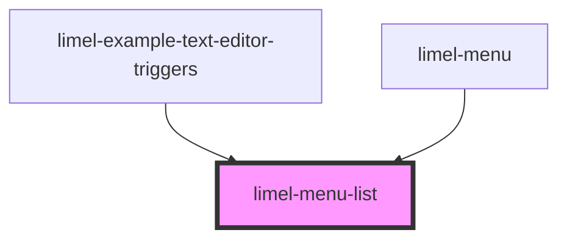

<!-- Auto Generated Below -->

## Properties

| Property     | Attribute     | Description                                                             | Type                                          | Default     |
| ------------ | ------------- | ----------------------------------------------------------------------- | --------------------------------------------- | ----------- |
| `badgeIcons` | `badge-icons` | Set to `true` if the list should display larger icons with a background | `boolean`                                     | `undefined` |
| `iconSize`   | `icon-size`   | Size of the icons in the list                                           | `"large" \| "medium" \| "small" \| "x-small"` | `'small'`   |
| `items`      | --            | List of items to display                                                | `(ListSeparator \| MenuItem<any>)[]`          | `undefined` |

## Events

| Event      | Description                                                                          | Type                         |
| ---------- | ------------------------------------------------------------------------------------ | ---------------------------- |
| `interact` | Fires when a user interacts with an item in the list (e.g., click, keyboard select). | `CustomEvent<MenuItem<any>>` |
| `select`   | Fired when a new value has been selected from the list.                              | `CustomEvent<MenuItem<any>>` |

## Dependencies

### Used by

 - [limel-example-text-editor-triggers](../text-editor/examples)
 - [limel-menu](../menu)

### Graph

----------------------------------------------

*Built with [StencilJS](https://stenciljs.com/)*
