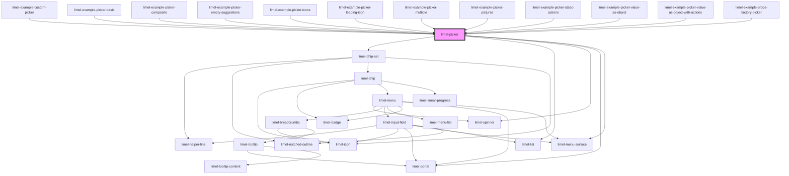

<!-- Auto Generated Below -->

## Properties

| Property               | Attribute                | Description                                                                                                                                                                                                                                                                                                                                                                                                                                                                              | Type                                                             | Default     |
| ---------------------- | ------------------------ | ---------------------------------------------------------------------------------------------------------------------------------------------------------------------------------------------------------------------------------------------------------------------------------------------------------------------------------------------------------------------------------------------------------------------------------------------------------------------------------------- | ---------------------------------------------------------------- | ----------- |
| `actionPosition`       | `action-position`        | Position of the custom static actions in the picker's results dropdown. Can be set to `'top'` or `'bottom'`.                                                                                                                                                                                                                                                                                                                                                                             | `"bottom" \| "top"`                                              | `'bottom'`  |
| `actionScrollBehavior` | `action-scroll-behavior` | Scroll behavior of the custom static actions, when user scrolls in the picker's results dropdown. Can be set to `'scroll'` which means the action items will scroll together with the list, or `'sticky'` which retains their position at the top or bottom of the drop down while scrolling.                                                                                                                                                                                            | `"scroll" \| "sticky"`                                           | `'sticky'`  |
| `actions`              | --                       | Static actions that can be clicked by the user.                                                                                                                                                                                                                                                                                                                                                                                                                                          | `ListItem<Action>[]`                                             | `[]`        |
| `allItems`             | --                       | Only used if no `searcher` is provided. The picker will then use a default search function that filters the `allItems` based on the `text` and `secondaryText` properties of the items. This way, custom search functions are typically only needed when the search is done on the server. For performance reasons, the default searcher will never return more than 20 items, but if there are more than 20 items, the rest can be found by typing more characters in the search field. | `ListItem<PickerValue>[]`                                        | `[]`        |
| `badgeIcons`           | `badge-icons`            | Whether badge icons should be used in the result list or not                                                                                                                                                                                                                                                                                                                                                                                                                             | `boolean`                                                        | `false`     |
| `delimiter`            | `delimiter`              | Sets delimiters between chips. Works only when `multiple` is `true`.                                                                                                                                                                                                                                                                                                                                                                                                                     | `string`                                                         | `null`      |
| `disabled`             | `disabled`               | True if the picker should be disabled                                                                                                                                                                                                                                                                                                                                                                                                                                                    | `boolean`                                                        | `false`     |
| `emptyResultMessage`   | `empty-result-message`   | A message to display when the search returned an empty result                                                                                                                                                                                                                                                                                                                                                                                                                            | `string`                                                         | `undefined` |
| `helperText`           | `helper-text`            | Optional helper text to display below the input field when it has focus                                                                                                                                                                                                                                                                                                                                                                                                                  | `string`                                                         | `undefined` |
| `invalid`              | `invalid`                | Set to `true` to indicate that the current value of the input field is invalid.                                                                                                                                                                                                                                                                                                                                                                                                          | `boolean`                                                        | `false`     |
| `label`                | `label`                  | Text to display for the input field of the picker                                                                                                                                                                                                                                                                                                                                                                                                                                        | `string`                                                         | `undefined` |
| `leadingIcon`          | `leading-icon`           | Leading icon to show to the far left in the text field                                                                                                                                                                                                                                                                                                                                                                                                                                   | `string`                                                         | `undefined` |
| `multiple`             | `multiple`               | True if multiple values are allowed                                                                                                                                                                                                                                                                                                                                                                                                                                                      | `boolean`                                                        | `false`     |
| `readonly`             | `readonly`               | Set to `true` to disable adding and removing items, but allow interaction with existing items.                                                                                                                                                                                                                                                                                                                                                                                           | `boolean`                                                        | `false`     |
| `required`             | `required`               | True if the control requires a value                                                                                                                                                                                                                                                                                                                                                                                                                                                     | `boolean`                                                        | `false`     |
| `searchLabel`          | `search-label`           | Search label to display in the input field when searching                                                                                                                                                                                                                                                                                                                                                                                                                                | `string`                                                         | `undefined` |
| `searcher`             | --                       | A search function that takes a search-string as an argument, and returns a promise that will eventually be resolved with an array of `ListItem`:s.  See the docs for the type `Searcher` for type information on the searcher function itself.                                                                                                                                                                                                                                           | `(query: string) => Promise<(ListSeparator \| ListItem<any>)[]>` | `undefined` |
| `value`                | --                       | Currently selected value or values. Where the value can be an object.                                                                                                                                                                                                                                                                                                                                                                                                                    | `ListItem<PickerValue> \| ListItem<PickerValue>[]`               | `undefined` |

## Events

| Event      | Description                                              | Type                                                            |
| ---------- | -------------------------------------------------------- | --------------------------------------------------------------- |
| `action`   | Emitted when the user selects an action.                 | `CustomEvent<Action>`                                           |
| `change`   | Fired when a new value has been selected from the picker | `CustomEvent<ListItem<PickerValue> \| ListItem<PickerValue>[]>` |
| `interact` | Fired when clicking on a selected value                  | `CustomEvent<ListItem<PickerValue>>`                            |

## Dependencies

### Used by

 - [limel-example-custom-picker](../form/examples)
 - [limel-example-picker-basic](examples)
 - [limel-example-picker-composite](examples)
 - [limel-example-picker-empty-suggestions](examples)
 - [limel-example-picker-icons](examples)
 - [limel-example-picker-leading-icon](examples)
 - [limel-example-picker-multiple](examples)
 - [limel-example-picker-pictures](examples)
 - [limel-example-picker-static-actions](examples)
 - [limel-example-picker-value-as-object](examples)
 - [limel-example-picker-value-as-object-with-actions](examples)
 - [limel-example-props-factory-picker](../form/examples)

### Depends on

- [limel-chip-set](../chip-set)
- [limel-list](../list)
- [limel-spinner](../spinner)
- [limel-portal](../portal)
- [limel-menu-surface](../menu-surface)

### Graph

----------------------------------------------

*Built with [StencilJS](https://stenciljs.com/)*
