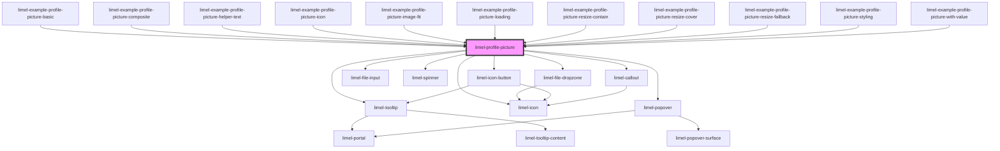

<!-- Auto Generated Below -->

## Overview

This component displays a profile picture, while allowing the user
to change it via a file input or drag-and-drop.

It supports client-side image resizing and conversion,
as well as a simple lazy-loading mechanism.

## Properties

| Property     | Attribute     | Description                                                                                                                                                                                                                                                          | Type                                                                                                                                                              | Default                                                   |
| ------------ | ------------- | -------------------------------------------------------------------------------------------------------------------------------------------------------------------------------------------------------------------------------------------------------------------- | ----------------------------------------------------------------------------------------------------------------------------------------------------------------- | --------------------------------------------------------- |
| `accept`     | `accept`      | A comma-separated list of accepted file types.                                                                                                                                                                                                                       | `string`                                                                                                                                                          | `'image/jpeg,image/png,image/heic,.jpg,.jpeg,.png,.heic'` |
| `disabled`   | `disabled`    | Disables user interaction. Prevents uploading new pictures or removing existing ones.                                                                                                                                                                                | `boolean`                                                                                                                                                         | `false`                                                   |
| `helperText` | `helper-text` | Helper text shown as a tooltip on hover or focus.                                                                                                                                                                                                                    | `string`                                                                                                                                                          | `undefined`                                               |
| `icon`       | `icon`        | Placeholder icon of the component, displayed when no image is present.                                                                                                                                                                                               | `Icon \| string`                                                                                                                                                  | `'user'`                                                  |
| `imageFit`   | `image-fit`   | How the image should fit within the container. - `cover` will fill the container and crop excess parts. - `contain` will scale the image to fit within the container without cropping.                                                                               | `"contain" \| "cover"`                                                                                                                                            | `'cover'`                                                 |
| `invalid`    | `invalid`     | Marks the control as invalid.                                                                                                                                                                                                                                        | `boolean`                                                                                                                                                         | `false`                                                   |
| `label`      | `label`       | Accessible label for the the browse button.                                                                                                                                                                                                                          | `string`                                                                                                                                                          | `undefined`                                               |
| `language`   | `language`    | Defines the language for translations. Will translate the translatable strings on the components.                                                                                                                                                                    | `"da" \| "de" \| "en" \| "fi" \| "fr" \| "nb" \| "nl" \| "no" \| "sv"`                                                                                            | `'en'`                                                    |
| `loading`    | `loading`     | Set to `true` to put the component in the `loading` state, and render an indeterminate progress indicator inside. This does _not_ disable the interactivity of the component!                                                                                        | `boolean`                                                                                                                                                         | `false`                                                   |
| `readonly`   | `readonly`    | Readonly prevents changing the value but allows interaction like focus.                                                                                                                                                                                              | `boolean`                                                                                                                                                         | `false`                                                   |
| `required`   | `required`    | Marks the control as required.                                                                                                                                                                                                                                       | `boolean`                                                                                                                                                         | `false`                                                   |
| `resize`     | `resize`      | Optional client-side resize before emitting the file. If provided, the selected image will be resized on the client device. :::note HEIC may not decode in all browsers; when decoding fails, the original file will be emitted. See the examples for more info. ::: | `{ width: number; height: number; fit?: "cover" \| "contain"; type?: "image/jpeg" \| "image/png"; quality?: number; rename?: (originalName: string) => string; }` | `undefined`                                               |
| `value`      | `value`       | Current image to display. Either a URL string or a `FileInfo` with an href.                                                                                                                                                                                          | `FileInfo \| string`                                                                                                                                              | `undefined`                                               |

## Events

| Event           | Description                                             | Type                      |
| --------------- | ------------------------------------------------------- | ------------------------- |
| `change`        | Emitted when the picture changes (first FileInfo only). | `CustomEvent<FileInfo>`   |
| `filesRejected` | Emitted when a file is rejected by accept filter.       | `CustomEvent<FileInfo[]>` |

## Dependencies

### Used by

 - [limel-example-profile-picture-basic](examples)
 - [limel-example-profile-picture-composite](examples)
 - [limel-example-profile-picture-helper-text](examples)
 - [limel-example-profile-picture-icon](examples)
 - [limel-example-profile-picture-image-fit](examples)
 - [limel-example-profile-picture-loading](examples)
 - [limel-example-profile-picture-resize-contain](examples)
 - [limel-example-profile-picture-resize-cover](examples)
 - [limel-example-profile-picture-resize-fallback](examples)
 - [limel-example-profile-picture-styling](examples)
 - [limel-example-profile-picture-with-value](examples)

### Depends on

- [limel-tooltip](../tooltip)
- [limel-file-dropzone](../file-dropzone)
- [limel-file-input](../file-input)
- [limel-icon](../icon)
- [limel-spinner](../spinner)
- [limel-popover](../popover)
- [limel-icon-button](../icon-button)
- [limel-callout](../callout)

### Graph

----------------------------------------------

*Built with [StencilJS](https://stenciljs.com/)*
