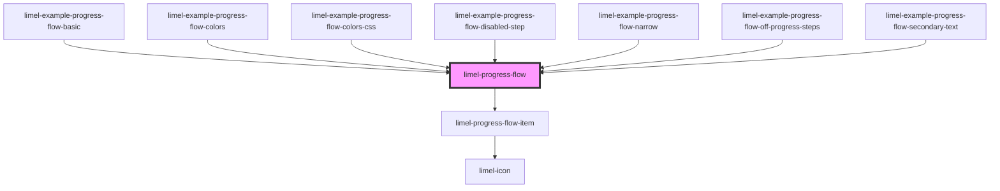

<!-- Auto Generated Below -->

## Properties

| Property    | Attribute    | Description                                                                                                                                                                                                                                                           | Type         | Default |
| ----------- | ------------ | --------------------------------------------------------------------------------------------------------------------------------------------------------------------------------------------------------------------------------------------------------------------- | ------------ | ------- |
| `disabled`  | `disabled`   | Set to `true` to disable the progress flow. Use `disabled` to indicate that the component can normally be interacted with, but is currently disabled. This tells the user that if certain requirements are met, the field may become enabled again.                   | `boolean`    | `false` |
| `flowItems` | `flow-items` | What flow items to render                                                                                                                                                                                                                                             | `FlowItem[]` | `[]`    |
| `readonly`  | `readonly`   | Disables the progress flow when `true`. This does not visualize the component that much differently. But since the component does not provide any feedback that users can interact with the component, it makes it perfect for illustrative and informative porpuses. | `boolean`    | `false` |

## Events

| Event    | Description                                                     | Type                    |
| -------- | --------------------------------------------------------------- | ----------------------- |
| `change` | Fired when a new value has been selected from the progress flow | `CustomEvent<FlowItem>` |

## Dependencies

### Used by

 - [limel-example-progress-flow-basic](examples)
 - [limel-example-progress-flow-colors](examples)
 - [limel-example-progress-flow-colors-css](examples)
 - [limel-example-progress-flow-disabled-step](examples)
 - [limel-example-progress-flow-narrow](examples)
 - [limel-example-progress-flow-off-progress-steps](examples)
 - [limel-example-progress-flow-secondary-text](examples)

### Depends on

- [limel-progress-flow-item](progress-flow-item)

### Graph

----------------------------------------------

*Built with [StencilJS](https://stenciljs.com/)*
