<!-- Auto Generated Below -->

## Properties

| Property     | Attribute     | Description                                                                                                                                                                                                          | Type                                  | Default     |
| ------------ | ------------- | -------------------------------------------------------------------------------------------------------------------------------------------------------------------------------------------------------------------- | ------------------------------------- | ----------- |
| `disabled`   | `disabled`    | Set to `true` to make the field disabled. and visually shows that the `select` component is editable but disabled. This tells the users that if certain requirements are met, the component may become interactable. | `boolean`                             | `false`     |
| `helperText` | `helper-text` | Optional helper text to display below the input field when it has focus.                                                                                                                                             | `string`                              | `undefined` |
| `invalid`    | `invalid`     | Set to `true` to indicate that the current value of the select is invalid.                                                                                                                                           | `boolean`                             | `undefined` |
| `label`      | `label`       | Text to display next to the select.                                                                                                                                                                                  | `string`                              | `undefined` |
| `multiple`   | `multiple`    | Set to `true` to allow multiple values to be selected.                                                                                                                                                               | `boolean`                             | `false`     |
| `options`    | --            | List of options.                                                                                                                                                                                                     | `(ListSeparator \| Option<string>)[]` | `[]`        |
| `readonly`   | `readonly`    | Set to `true` to make the field read-only. This visualizes the component slightly differently. But shows no visual sign indicating that the component is disabled or can ever become interactable.                   | `boolean`                             | `false`     |
| `required`   | `required`    | True if the control requires a value.                                                                                                                                                                                | `boolean`                             | `false`     |
| `value`      | --            | Currently selected value or values. If `multiple` is `true`, this must be an array. Otherwise it must be a single value.                                                                                             | `Option<string> \| Option<string>[]`  | `undefined` |

## Events

| Event    | Description                        | Type                                              |
| -------- | ---------------------------------- | ------------------------------------------------- |
| `change` | Emitted when the value is changed. | `CustomEvent<Option<string> \| Option<string>[]>` |

## Dependencies

### Used by

 - [limel-example-chart-axis-increment](../chart/examples)
 - [limel-example-chart-axis-labels](../chart/examples)
 - [limel-example-chart-multi-axis](../chart/examples)
 - [limel-example-chart-multi-axis-area-with-negative-start-values](../chart/examples)
 - [limel-example-chart-multi-axis-with-negative-start-values](../chart/examples)
 - [limel-example-chart-type-area](../chart/examples)
 - [limel-example-chart-type-bar](../chart/examples)
 - [limel-example-chart-type-dot](../chart/examples)
 - [limel-example-chart-type-gantt](../chart/examples)
 - [limel-example-chart-type-line](../chart/examples)
 - [limel-example-chip-size](../chip/examples)
 - [limel-example-dialog-heading](../dialog/examples)
 - [limel-example-file-viewer-office](../file-viewer/examples)
 - [limel-example-header-slot-actions](../header/examples)
 - [limel-example-input-field-number](../input-field/examples)
 - [limel-example-linear-progress-color](../linear-progress/examples)
 - [limel-example-list-badge-icons-with-multiple-lines](../list/examples)
 - [limel-example-list-item-icon-size](../list-item/examples)
 - [limel-example-list-item-multiple-lines](../list-item/examples)
 - [limel-example-menu-open-direction](../menu/examples)
 - [limel-example-menu-surface-width](../menu/examples)
 - [limel-example-picker-static-actions](../picker/examples)
 - [limel-example-profile-picture-image-fit](../profile-picture/examples)
 - [limel-example-radio-button-group-multiple-lines](../radio-button-group/examples)
 - [limel-example-select](examples)
 - [limel-example-select-change-options](examples)
 - [limel-example-select-dialog](examples)
 - [limel-example-select-multiple](examples)
 - [limel-example-select-preselected](examples)
 - [limel-example-select-with-empty-option](examples)
 - [limel-example-select-with-icons](examples)
 - [limel-example-select-with-secondary-text](examples)
 - [limel-example-select-with-separators](examples)
 - [limel-example-table-pagination](../table/examples)
 - [limel-example-text-editor-composite](../text-editor/examples)
 - [limel-example-text-editor-ui](../text-editor/examples)

### Depends on

- [limel-notched-outline](../notched-outline)
- [limel-icon](../icon)
- [limel-helper-line](../helper-line)
- [limel-portal](../portal)
- [limel-menu-surface](../menu-surface)
- [limel-list](../list)

### Graph

```mermaid
graph TD;
  limel-select --> limel-notched-outline
  limel-select --> limel-icon
  limel-select --> limel-helper-line
  limel-select --> limel-portal
  limel-select --> limel-menu-surface
  limel-select --> limel-list
  limel-example-chart-axis-increment --> limel-select
  limel-example-chart-axis-labels --> limel-select
  limel-example-chart-multi-axis --> limel-select
  limel-example-chart-multi-axis-area-with-negative-start-values --> limel-select
  limel-example-chart-multi-axis-with-negative-start-values --> limel-select
  limel-example-chart-type-area --> limel-select
  limel-example-chart-type-bar --> limel-select
  limel-example-chart-type-dot --> limel-select
  limel-example-chart-type-gantt --> limel-select
  limel-example-chart-type-line --> limel-select
  limel-example-chip-size --> limel-select
  limel-example-dialog-heading --> limel-select
  limel-example-file-viewer-office --> limel-select
  limel-example-header-slot-actions --> limel-select
  limel-example-input-field-number --> limel-select
  limel-example-linear-progress-color --> limel-select
  limel-example-list-badge-icons-with-multiple-lines --> limel-select
  limel-example-list-item-icon-size --> limel-select
  limel-example-list-item-multiple-lines --> limel-select
  limel-example-menu-open-direction --> limel-select
  limel-example-menu-surface-width --> limel-select
  limel-example-picker-static-actions --> limel-select
  limel-example-profile-picture-image-fit --> limel-select
  limel-example-radio-button-group-multiple-lines --> limel-select
  limel-example-select --> limel-select
  limel-example-select-change-options --> limel-select
  limel-example-select-dialog --> limel-select
  limel-example-select-multiple --> limel-select
  limel-example-select-preselected --> limel-select
  limel-example-select-with-empty-option --> limel-select
  limel-example-select-with-icons --> limel-select
  limel-example-select-with-secondary-text --> limel-select
  limel-example-select-with-separators --> limel-select
  limel-example-table-pagination --> limel-select
  limel-example-text-editor-composite --> limel-select
  limel-example-text-editor-ui --> limel-select
  style limel-select fill:#f9f,stroke:#333,stroke-width:4px
```

----------------------------------------------

*Built with [StencilJS](https://stenciljs.com/)*
