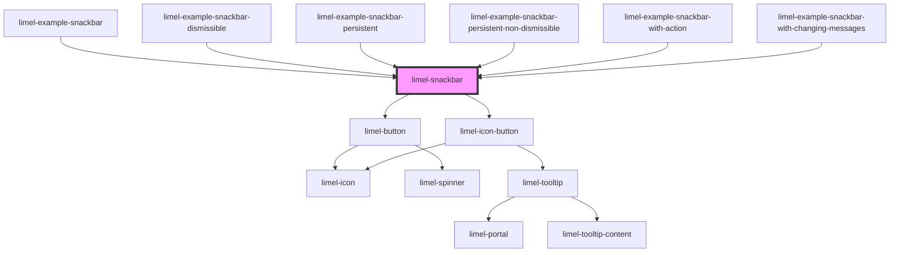

<!-- Auto Generated Below -->

## Overview

A Snackbar –also known as "Toast"– is used to inform the end user
about an action or a process in the system.
The information could vary from announcing that a process has just started,
is taking place now, has ended, or has been interrupted or canceled.

The information that you provide using a snackbar should be:
- temporary
- contextual
- short
- and most importantly, ignorable.

It means if the user misses the information, it shouldn't be a big deal.

:::note
If the information you want to display has a higher importance or priority,
and you need to make sure that the user takes an action to dismiss it,
consider using the [Banner](/#/component/limel-banner/) component instead.
For more complex interactions and for delivering more detailed information,
[Dialog](/#/component/limel-dialog/) is a better choice.
:::

## Properties

| Property      | Attribute     | Description                                                                                                                                                                                                                                                                                       | Type                                                                   | Default     |
| ------------- | ------------- | ------------------------------------------------------------------------------------------------------------------------------------------------------------------------------------------------------------------------------------------------------------------------------------------------- | ---------------------------------------------------------------------- | ----------- |
| `actionText`  | `action-text` | The text to display for the action button.                                                                                                                                                                                                                                                        | `string`                                                               | `undefined` |
| `dismissible` | `dismissible` | When `true` displays a dismiss button on the snackbar, allowing users to close it.                                                                                                                                                                                                                | `boolean`                                                              | `true`      |
| `language`    | `language`    | Defines the language for translations.                                                                                                                                                                                                                                                            | `"da" \| "de" \| "en" \| "fi" \| "fr" \| "nb" \| "nl" \| "no" \| "sv"` | `'en'`      |
| `message`     | `message`     | The text message to display.                                                                                                                                                                                                                                                                      | `string`                                                               | `undefined` |
| `multiline`   | `multiline`   | **[DEPRECATED]** Setting this property no longer has any effect. The property will be removed in a future major version.  Whether to show the snackbar with space for multiple lines of text                                                               | `boolean`                                                              | `undefined` |
| `open`        | `open`        | `true` if the snackbar is open, `false` otherwise.                                                                                                                                                                                                                                                | `boolean`                                                              | `false`     |
| `timeout`     | `timeout`     | The amount of time in milliseconds to show the snackbar. If set to `-1`, the snackbar will be persistent. This means: - either the end user will need to close it manually, which requires the `dismissible` property to be set to `true`. - or the snackbar needs to be closed programmatically. | `number`                                                               | `5000`      |

## Events

| Event    | Description                               | Type                |
| -------- | ----------------------------------------- | ------------------- |
| `action` | Emitted when the action button is pressed | `CustomEvent<void>` |
| `hide`   | Emitted when the snackbar hides itself    | `CustomEvent<void>` |

## Methods

### `show() => Promise<void>`

**[DEPRECATED]** Use the `open` property instead.  Show the snackbar

#### Returns

Type: `Promise<void>`

## Dependencies

### Used by

 - [limel-example-snackbar](examples)
 - [limel-example-snackbar-dismissible](examples)
 - [limel-example-snackbar-persistent](examples)
 - [limel-example-snackbar-persistent-non-dismissible](examples)
 - [limel-example-snackbar-with-action](examples)
 - [limel-example-snackbar-with-changing-messages](examples)

### Depends on

- [limel-button](../button)
- [limel-icon-button](../icon-button)

### Graph

----------------------------------------------

*Built with [StencilJS](https://stenciljs.com/)*
