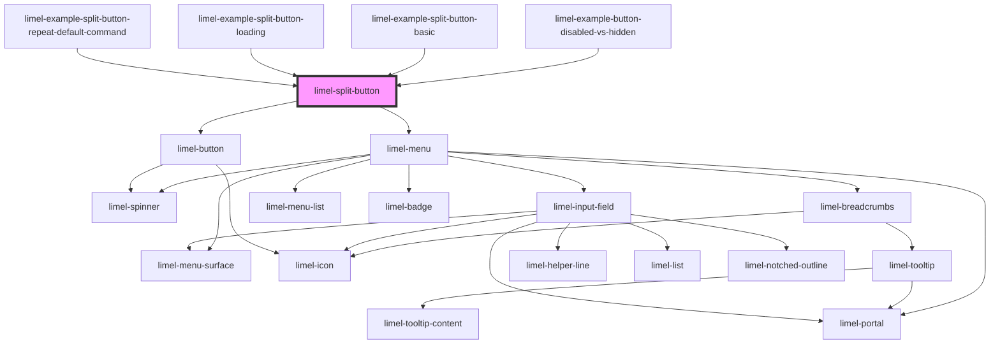

<!-- Auto Generated Below -->

## Overview

A split button is a button with two components:
a button and a side-menu attached to it.

Clicking on the button runs a default action,
and clicking on the arrow opens up a list of other possible actions.

:::warning
- Never use a split button for navigation purposes, such as going to next page.
The button should only be used for performing commands!
- Never use this component instead of a Select or Menu component!
:::

## Properties

| Property        | Attribute        | Description                                                                                               | Type                                 | Default     |
| --------------- | ---------------- | --------------------------------------------------------------------------------------------------------- | ------------------------------------ | ----------- |
| `disabled`      | `disabled`       | Set to `true` to disable the button.                                                                      | `boolean`                            | `false`     |
| `icon`          | `icon`           | Set icon for the button                                                                                   | `string`                             | `undefined` |
| `items`         | `items`          | A list of items and separators to show in the menu.                                                       | `(ListSeparator \| MenuItem<any>)[]` | `[]`        |
| `label`         | `label`          | The text to show on the default action part of the button.                                                | `string`                             | `undefined` |
| `loading`       | `loading`        | Set to `true` to put the button in the `loading` state. This also disables the button.                    | `boolean`                            | `false`     |
| `loadingFailed` | `loading-failed` | Set to `true` to indicate failure instead of success when the button is no longer in the `loading` state. | `boolean`                            | `false`     |
| `primary`       | `primary`        | Set to `true` to make the button primary.                                                                 | `boolean`                            | `false`     |

## Events

| Event    | Description                              | Type                         |
| -------- | ---------------------------------------- | ---------------------------- |
| `select` | Is emitted when a menu item is selected. | `CustomEvent<MenuItem<any>>` |

## Dependencies

### Used by

 - [limel-example-button-disabled-vs-hidden](../../design-guidelines/disabled-hidden/examples)
 - [limel-example-split-button-basic](examples)
 - [limel-example-split-button-loading](examples)
 - [limel-example-split-button-repeat-default-command](examples)

### Depends on

- [limel-menu](../menu)
- [limel-button](../button)

### Graph

----------------------------------------------

*Built with [StencilJS](https://stenciljs.com/)*
