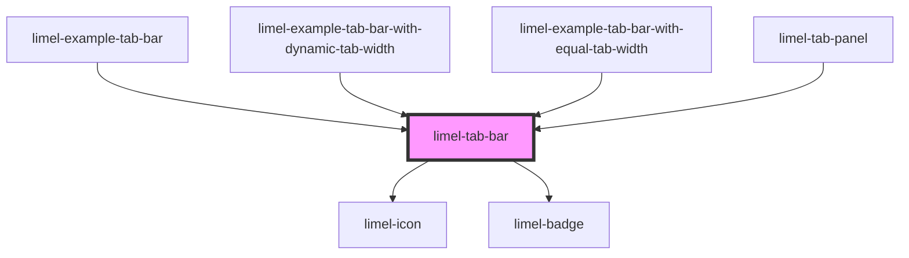

<!-- Auto Generated Below -->

## Overview

Tabs are great to organize information hierarchically in the interface and divide it into distinct categories. Using tabs, you can create groups of content that are related and at the same level in the hierarchy.
:::warning
Tab bars should be strictly used for navigation at the top levels.
They should never be used to perform actions, or navigate away from the view which contains them.
:::
An exception for using tab bars in a high level of hierarchy is their usage in modals. This is because modals are perceived as a separate place and not a part of the current context. Therefore you can use tab bars in a modal to group and organize its content.
A tab bar can contain an unlimited number of tabs. However, depending on the device width and width of the tabs, the number of tabs that are visible at the same time will vary. When there is limited horizontal space, the component shows a left-arrow and/or right-arrow button, which scrolls and reveals the additional tabs. The tab bar can also be swiped left and right on a touch-device.
:::tip Other things to consider
Never divide the content of a tab using a nested tab bar.
Never place two tab bars within the same screen.
Never use background color for icons in tabs.
Avoid having long labels for tabs.
A tab will never be removed or get disabled, even if there is no content under it.
:::

## Properties

| Property | Attribute | Description             | Type    | Default |
| -------- | --------- | ----------------------- | ------- | ------- |
| `tabs`   | --        | List of tabs to display | `Tab[]` | `[]`    |

## Events

| Event       | Description                         | Type               |
| ----------- | ----------------------------------- | ------------------ |
| `changeTab` | Emitted when a tab has been changed | `CustomEvent<Tab>` |

## Dependencies

### Used by

 - [limel-example-tab-bar](examples)
 - [limel-example-tab-bar-with-dynamic-tab-width](examples)
 - [limel-example-tab-bar-with-equal-tab-width](examples)
 - [limel-tab-panel](../tab-panel)

### Depends on

- [limel-icon](../icon)
- [limel-badge](../badge)

### Graph

----------------------------------------------

*Built with [StencilJS](https://stenciljs.com/)*
