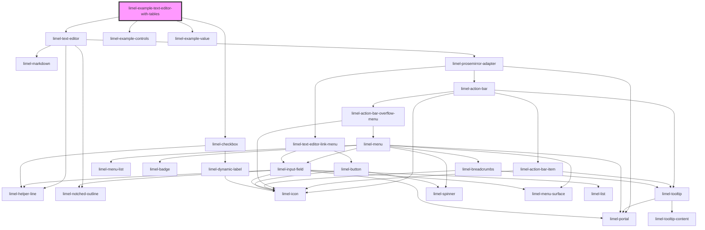

<!-- Auto Generated Below -->

## Overview

Text editor with tables (HTML mode only).

Basic table support is available when using the text editor in `HTML` mode.
This allows you to paste and display tables in the text editor.
Complex operations are not supported, adding and removing columns are not supported.

Tables will only appear as expected in text-editor fields that are in `HTML` mode.

## Dependencies

### Depends on

- [limel-text-editor](..)
- [limel-example-controls](../../../examples)
- [limel-checkbox](../../checkbox)
- [limel-example-value](../../../examples)

### Graph

----------------------------------------------

*Built with [StencilJS](https://stenciljs.com/)*
