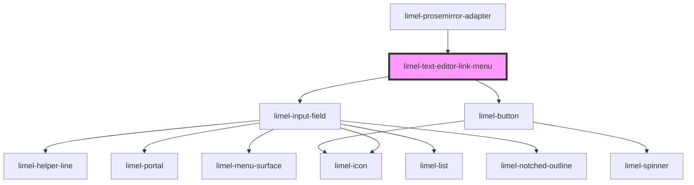

<!-- Auto Generated Below -->

## Overview

This component is a menu for editing a link in the text editor.
It allows the user to input the text and url for the link.

## Properties

| Property   | Attribute  | Description                            | Type                                                                   | Default     |
| ---------- | ---------- | -------------------------------------- | ---------------------------------------------------------------------- | ----------- |
| `isOpen`   | `is-open`  | Open state of the link-menu dialog     | `boolean`                                                              | `false`     |
| `language` | `language` | Defines the language for translations. | `"da" \| "de" \| "en" \| "fi" \| "fr" \| "nb" \| "nl" \| "no" \| "sv"` | `'en'`      |
| `link`     | `link`     | The link                               | `{ text?: string; href: string; }`                                     | `undefined` |

## Events

| Event        | Description                                                                                                                       | Type                                            |
| ------------ | --------------------------------------------------------------------------------------------------------------------------------- | ----------------------------------------------- |
| `cancel`     | Emitted when the menu is closed from inside the component. (*Not* emitted when the consumer sets the `open`-property to `false`.) | `CustomEvent<void>`                             |
| `linkChange` | Emitted when the user inputs new values for the link                                                                              | `CustomEvent<{ text?: string; href: string; }>` |
| `save`       | Emitted when the menu is saved from inside the component.                                                                         | `CustomEvent<void>`                             |

## Dependencies

### Used by

 - [limel-prosemirror-adapter](../prosemirror-adapter)

### Depends on

- [limel-input-field](../../input-field)
- [limel-button](../../button)

### Graph

----------------------------------------------

*Built with [StencilJS](https://stenciljs.com/)*
