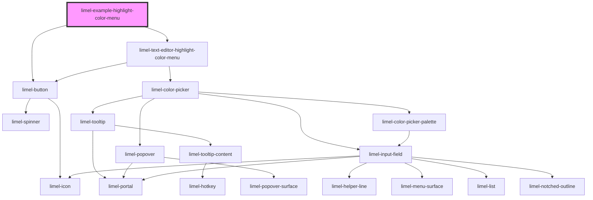

<!-- Auto Generated Below -->

## Overview

The highlight color menu lets the user pick a color, and emits `save` or
`cancel` when done. The text editor listens to these events and applies
the picked color as a highlight mark on the current selection.

This example shows the open, pick, save and cancel flow, and previews the
saved color the way the editor renders a highlight.

## Dependencies

### Depends on

- [limel-button](../../../button)
- [limel-text-editor-highlight-color-menu](..)

### Graph

----------------------------------------------

*Built with [StencilJS](https://stenciljs.com/)*
