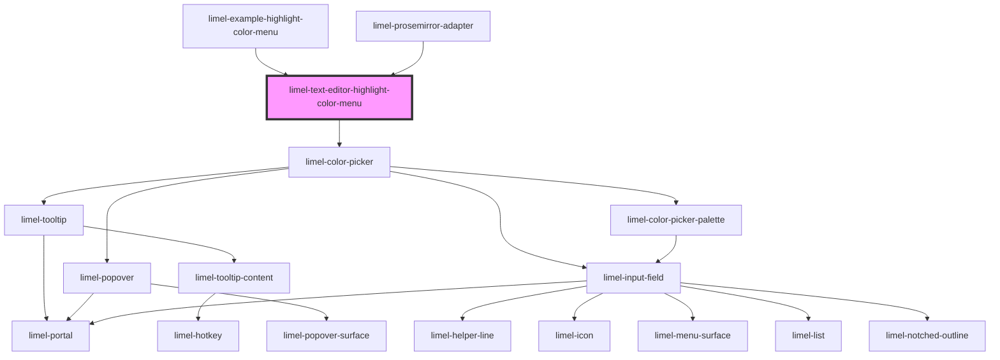

<!-- Auto Generated Below -->

## Overview

This component is a menu for selecting highlight color in the text editor.
It allows the user to choose a color for text highlighting.

## Properties

| Property   | Attribute  | Description                                   | Type                                                                   | Default     |
| ---------- | ---------- | --------------------------------------------- | ---------------------------------------------------------------------- | ----------- |
| `color`    | `color`    | The selected color                            | `string`                                                               | `'#fff176'` |
| `isOpen`   | `is-open`  | Open state of the highlight-color-menu dialog | `boolean`                                                              | `false`     |
| `language` | `language` | Defines the language for translations.        | `"da" \| "de" \| "en" \| "fi" \| "fr" \| "nb" \| "nl" \| "no" \| "sv"` | `'en'`      |

## Events

| Event         | Description                                                                                                                                | Type                  |
| ------------- | ------------------------------------------------------------------------------------------------------------------------------------------ | --------------------- |
| `cancel`      | Emitted when the menu is closed from inside the component. (*Not* emitted when the consumer sets the `open`-property to `false`.)          | `CustomEvent<void>`   |
| `colorChange` | Emitted when the user selects a new color                                                                                                  | `CustomEvent<string>` |
| `save`        | Emitted when a color is applied from inside the component. Picking a color applies it immediately, so this always follows a `colorChange`. | `CustomEvent<void>`   |

## Dependencies

### Used by

 - [limel-example-highlight-color-menu](examples)
 - [limel-prosemirror-adapter](../prosemirror-adapter)

### Depends on

- [limel-color-picker](../../color-picker)

### Graph

----------------------------------------------

*Built with [StencilJS](https://stenciljs.com/)*
