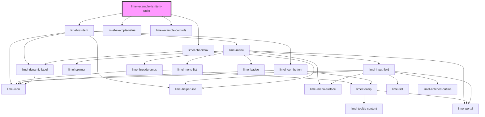

# limel-example-list-item-radio

<!-- Auto Generated Below -->

## Overview

Radio button list items

This example shows how list items can be displayed as radio buttons.
Radio buttons allow users to select only one option from a group.

:::important
- Set `role="radiogroup"` on the container for accessibility.
- Only one value is selected at a time; clicks and Enter/Space update
  `selectedValue` and re-render.
:::

:::note
The radio visuals are purely presentational; state comes from the parent.
In production, prefer using `limel-list type="radio"` to centralize logic.
:::

## Dependencies

### Depends on

- [limel-list-item](..)
- [limel-example-value](../../../examples)
- [limel-example-controls](../../../examples)
- [limel-checkbox](../../checkbox)

### Graph

----------------------------------------------

*Built with [StencilJS](https://stenciljs.com/)*
