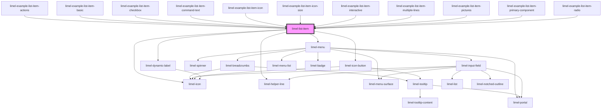

# limel-list-item

<!-- Auto Generated Below -->

## Overview

This components displays the list item.
This centralizes styles and functionality, and helps reduce redundant code
in consumer components such as `limel-list` and `limel-menu-list`.

:::note
The component has `shadow: false`. There are a few reasons for it:
1. This is to improve performance, and ensure that its internal elements are
considered as internal parts of the consumer's DOM.
2. The consumer does not need to implement the interactive styles
(such as `visualize-keyboard-focus` mixin) on their own. Since there is no
shadow DOM, our mixins can be applied directly to the `limel-list-item` elements,
within the component's own styles.
3. Most importantly, the MDCList checks the light DOM of each list item
to find native inputs to decide the list mode (checkbox/radio).
With `shadow: true`, those inputs would be hidden inside the `limel-list-items`’s
shadow DOM, so MDC wouldn’t detect them and therefore throw errors, when given
an array index (for the items).
With `shadow: false`, the native `<input type="checkbox/radio">` from this template
would be visible to MDC.
:::

## Properties

| Property           | Attribute        | Description                                                                                                                                                                                                                                                               | Type                                                                   | Default      |
| ------------------ | ---------------- | ------------------------------------------------------------------------------------------------------------------------------------------------------------------------------------------------------------------------------------------------------------------------- | ---------------------------------------------------------------------- | ------------ |
| `actions`          | --               | {@inheritdoc ListItem.selected}                                                                                                                                                                                                                                           | `(ListSeparator \| MenuItem<any>)[]`                                   | `undefined`  |
| `badgeIcon`        | `badge-icon`     | Set to `true` if the list should display larger icons with a background                                                                                                                                                                                                   | `boolean`                                                              | `false`      |
| `disabled`         | `disabled`       | {@inheritdoc ListItem.disabled}                                                                                                                                                                                                                                           | `boolean`                                                              | `false`      |
| `icon`             | `icon`           | {@inheritdoc ListItem.icon}                                                                                                                                                                                                                                               | `Icon \| string`                                                       | `undefined`  |
| `iconSize`         | `icon-size`      | Size of the icon displayed for this item.                                                                                                                                                                                                                                 | `"large" \| "medium" \| "small" \| "x-small"`                          | `'small'`    |
| `image`            | --               | {@inheritdoc ListItem.image}                                                                                                                                                                                                                                              | `Image`                                                                | `undefined`  |
| `language`         | `language`       | Defines the language for translations. Will translate the translatable strings on the components.                                                                                                                                                                         | `"da" \| "de" \| "en" \| "fi" \| "fr" \| "nb" \| "nl" \| "no" \| "sv"` | `'en'`       |
| `primaryComponent` | --               | {@inheritdoc ListItem.selected}                                                                                                                                                                                                                                           | `ListComponent`                                                        | `undefined`  |
| `secondaryText`    | `secondary-text` | {@inheritdoc ListItem.secondaryText}                                                                                                                                                                                                                                      | `string`                                                               | `undefined`  |
| `selected`         | `selected`       | {@inheritdoc ListItem.selected}                                                                                                                                                                                                                                           | `boolean`                                                              | `false`      |
| `text`             | `text`           | {@inheritdoc ListItem.text}                                                                                                                                                                                                                                               | `string`                                                               | `undefined`  |
| `type`             | `type`           | The semantic role of the list item. This affects the ARIA role and the interaction behavior.  - 'option' → selectable via click/Enter/Space, aria-selected - 'radio'/'checkbox' → selectable, aria-checked - 'menuitem'/'listitem' → activation only, no selection toggle | `"checkbox" \| "listitem" \| "menuitem" \| "option" \| "radio"`        | `'listitem'` |
| `value`            | `value`          | {@inheritdoc ListItem.value}                                                                                                                                                                                                                                              | `any`                                                                  | `undefined`  |

## Events

| Event      | Description                                                                                | Type                                                       |
| ---------- | ------------------------------------------------------------------------------------------ | ---------------------------------------------------------- |
| `interact` | Emitted when the list item toggles selection (only for selectable types and not disabled). | `CustomEvent<{ selected: boolean; item: ListItem<any>; }>` |

## Dependencies

### Used by

 - [limel-example-list-item-actions](examples)
 - [limel-example-list-item-basic](examples)
 - [limel-example-list-item-checkbox](examples)
 - [limel-example-list-item-command-text](examples)
 - [limel-example-list-item-icon](examples)
 - [limel-example-list-item-icon-size](examples)
 - [limel-example-list-item-interactive](examples)
 - [limel-example-list-item-multiple-lines](examples)
 - [limel-example-list-item-pictures](examples)
 - [limel-example-list-item-primary-component](examples)
 - [limel-example-list-item-radio](examples)

### Depends on

- [limel-icon](../icon)
- [limel-menu](../menu)
- [limel-icon-button](../icon-button)
- [limel-dynamic-label](../dynamic-label)
- [limel-helper-line](../helper-line)

### Graph

----------------------------------------------

*Built with [StencilJS](https://stenciljs.com/)*
