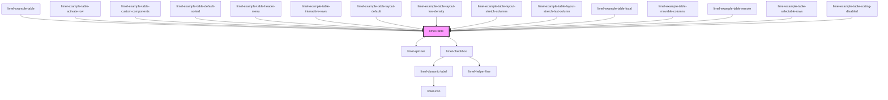

# limel-table

<!-- Auto Generated Below -->

## Properties

| Property         | Attribute         | Description                                                                                                                                                                                                                                                                                                                                                                                                                                                      | Type                                                                   | Default      |
| ---------------- | ----------------- | ---------------------------------------------------------------------------------------------------------------------------------------------------------------------------------------------------------------------------------------------------------------------------------------------------------------------------------------------------------------------------------------------------------------------------------------------------------------- | ---------------------------------------------------------------------- | ------------ |
| `activeRow`      | --                | Active row in the table                                                                                                                                                                                                                                                                                                                                                                                                                                          | `{ id?: string \| number; }`                                           | `undefined`  |
| `aggregates`     | --                | Column aggregates to be displayed in the table                                                                                                                                                                                                                                                                                                                                                                                                                   | `ColumnAggregate[]`                                                    | `undefined`  |
| `columns`        | --                | Columns used to display the data                                                                                                                                                                                                                                                                                                                                                                                                                                 | `Column<any>[]`                                                        | `[]`         |
| `data`           | --                | Data to be displayed in the table                                                                                                                                                                                                                                                                                                                                                                                                                                | `object[]`                                                             | `[]`         |
| `emptyMessage`   | `empty-message`   | A message to display when the table has no data                                                                                                                                                                                                                                                                                                                                                                                                                  | `string`                                                               | `undefined`  |
| `language`       | `language`        | Defines the language for translations.                                                                                                                                                                                                                                                                                                                                                                                                                           | `"da" \| "de" \| "en" \| "fi" \| "fr" \| "nb" \| "nl" \| "no" \| "sv"` | `'en'`       |
| `layout`         | `layout`          | Defines the layout of the table, based on how width of the columns are calculated.  - `default`: makes columns as wide as their contents. - `stretchLastColumn`: makes columns as wide as their contents, stretch the last column to fill up the remaining table width. - `stretchColumns`: stretches all columns to fill the available width when possible. - `lowDensity`: makes columns as wide as their contents, and creates a low density and airy layout. | `"default" \| "lowDensity" \| "stretchColumns" \| "stretchLastColumn"` | `undefined`  |
| `loading`        | `loading`         | Set to `true` to trigger loading animation                                                                                                                                                                                                                                                                                                                                                                                                                       | `boolean`                                                              | `false`      |
| `mode`           | `mode`            | Set to either `local` or `remote` to change how the table handles the loaded data. When in `local` mode, all sorting and pagination will be done locally with the data given. When in `remote` mode, the consumer is responsible to give the table new data when a `load` event occurs                                                                                                                                                                           | `"local" \| "remote"`                                                  | `'local'`    |
| `movableColumns` | `movable-columns` | Set to `true` to enable reordering of the columns by dragging them                                                                                                                                                                                                                                                                                                                                                                                               | `boolean`                                                              | `undefined`  |
| `page`           | `page`            | The page to show                                                                                                                                                                                                                                                                                                                                                                                                                                                 | `number`                                                               | `FIRST_PAGE` |
| `pageSize`       | `page-size`       | Number of rows per page                                                                                                                                                                                                                                                                                                                                                                                                                                          | `number`                                                               | `undefined`  |
| `selectable`     | `selectable`      | Enables row selection                                                                                                                                                                                                                                                                                                                                                                                                                                            | `boolean`                                                              | `undefined`  |
| `selection`      | --                | Selected data. Requires `selectable` to be true.                                                                                                                                                                                                                                                                                                                                                                                                                 | `object[]`                                                             | `undefined`  |
| `sorting`        | --                | The initial sorted columns                                                                                                                                                                                                                                                                                                                                                                                                                                       | `ColumnSorter[]`                                                       | `[]`         |
| `totalRows`      | `total-rows`      | The number of total rows available for the data                                                                                                                                                                                                                                                                                                                                                                                                                  | `number`                                                               | `undefined`  |

## Events

| Event           | Description                                                                                                                  | Type                          |
| --------------- | ---------------------------------------------------------------------------------------------------------------------------- | ----------------------------- |
| `activate`      | Emitted when a row is activated                                                                                              | `CustomEvent<object>`         |
| `changeColumns` | Emitted when the columns have been changed                                                                                   | `CustomEvent<Column<any>[]>`  |
| `changePage`    | Emitted when a new page has been set                                                                                         | `CustomEvent<number>`         |
| `load`          | Emitted when `mode` is `remote` and the table is loading new data. The consumer is responsible for giving the table new data | `CustomEvent<TableParams>`    |
| `select`        | Emitted when the row selection has been changed                                                                              | `CustomEvent<object[]>`       |
| `selectAll`     | Emitted when the select all rows state is toggled                                                                            | `CustomEvent<boolean>`        |
| `sort`          | Emitted when `mode` is `local` the data is sorted                                                                            | `CustomEvent<ColumnSorter[]>` |

## Dependencies

### Used by

 - [limel-example-table](examples)
 - [limel-example-table-activate-row](examples)
 - [limel-example-table-custom-components](examples)
 - [limel-example-table-default-sorted](examples)
 - [limel-example-table-header-menu](examples)
 - [limel-example-table-interactive-rows](examples)
 - [limel-example-table-layout-default](examples)
 - [limel-example-table-layout-low-density](examples)
 - [limel-example-table-layout-stretch-columns](examples)
 - [limel-example-table-layout-stretch-last-column](examples)
 - [limel-example-table-local](examples)
 - [limel-example-table-movable-columns](examples)
 - [limel-example-table-remote](examples)
 - [limel-example-table-selectable-rows](examples)
 - [limel-example-table-sorting-disabled](examples)

### Depends on

- [limel-spinner](../spinner)
- [limel-checkbox](../checkbox)

### Graph

----------------------------------------------

*Built with [StencilJS](https://stenciljs.com/)*
