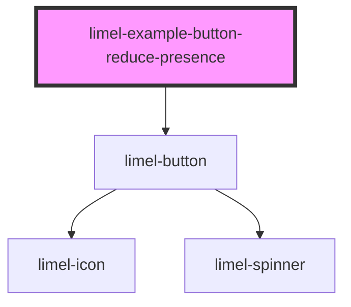

# limel-example-button-reduce-presence

<!-- Auto Generated Below -->

## Overview

Reduce Presence

This example is identical to the "With click handler" example, except that
here, the `has-reduced-presence` class has been set to `true`. This will hide
the button when it is disabled. However, it will also make sure that the
button remains visible while the loading animation is ongoing. When the
animation is done and the checkmark has been shown, the button will hide.

Read more in the [Design Guidelines](#/DesignGuidelines/declutter.md/)

## Dependencies

### Depends on

- [limel-button](..)

### Graph

----------------------------------------------

*Built with [StencilJS](https://stenciljs.com/)*
