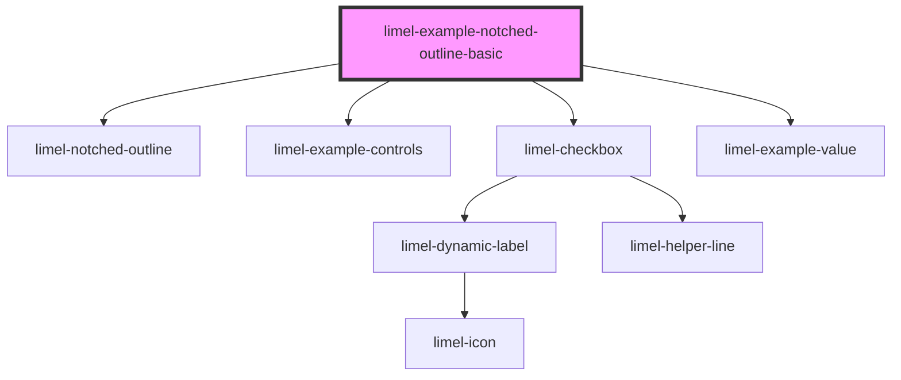

# limel-example-notched-outline-basic

<!-- Auto Generated Below -->

## Overview

Basic example

Notice that the wrapping div has a hardcoded height,
which results in the notched outline to wrap around
the div.

## Dependencies

### Depends on

- [limel-notched-outline](..)
- [limel-example-controls](../../../examples)
- [limel-checkbox](../../checkbox)
- [limel-example-value](../../../examples)

### Graph

----------------------------------------------

*Built with [StencilJS](https://stenciljs.com/)*
