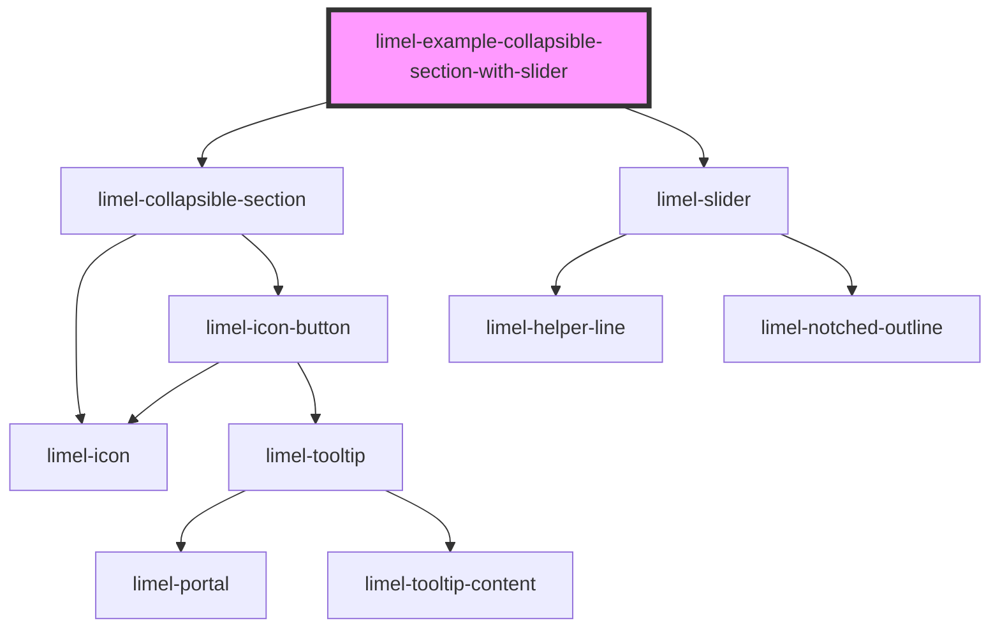

# limel-example-collapsible-section-with-slider

<!-- Auto Generated Below -->

## Overview

With a limel-slider - for testing
:::note
Some elements need to be redrawn if they were created
while their container was hidden. The collapsible
section will emit a resize event after opening, to make this happen.
:::

## Dependencies

### Depends on

- [limel-collapsible-section](..)
- [limel-slider](../../slider)

### Graph

----------------------------------------------

*Built with [StencilJS](https://stenciljs.com/)*
