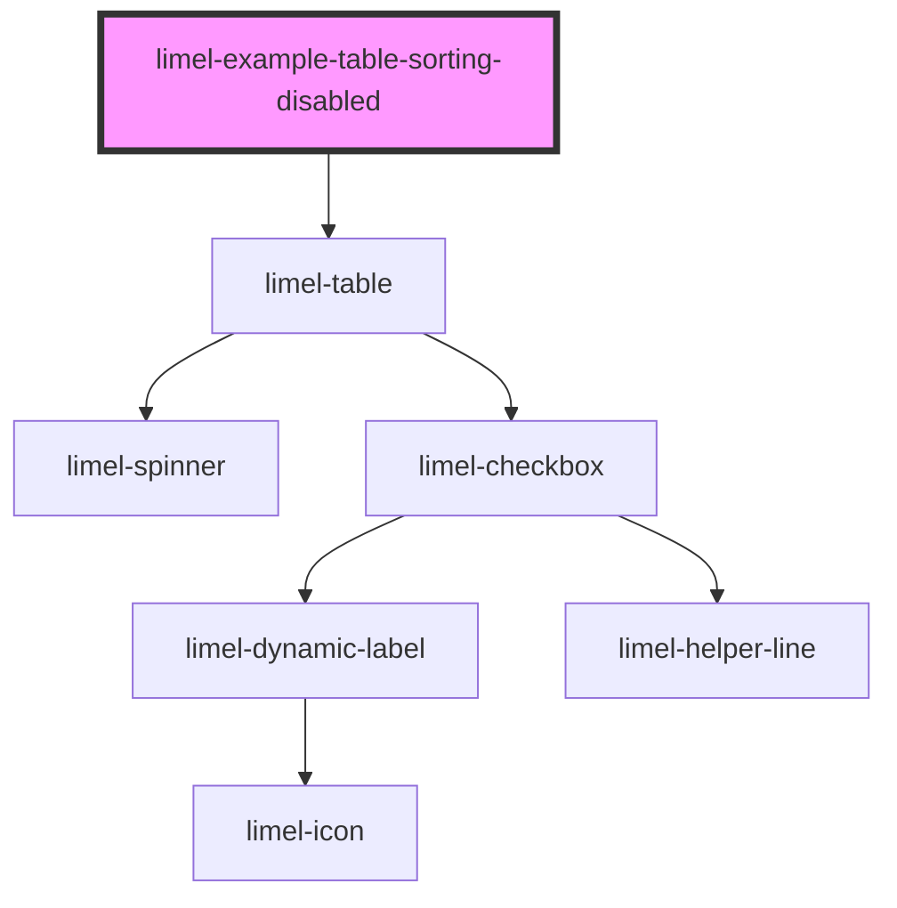

# limel-example-table-sorting-disabled

<!-- Auto Generated Below -->

## Overview

Disable column sorting

By default, all columns can be sorted by end-users, if they click on
a column header. An arrow icon on the header visualizes the
direction of sorting, when a column is sorted.

However, you can disable the sorting possibility in individual columns,
by setting the `headerSort` to `false`.

## Dependencies

### Depends on

- [limel-table](..)

### Graph

----------------------------------------------

*Built with [StencilJS](https://stenciljs.com/)*
