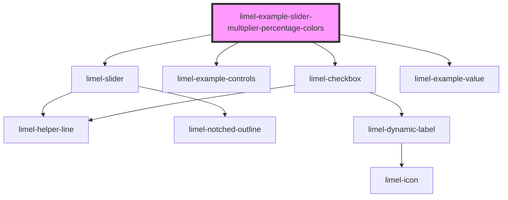

# limel-example-slider-multiplier-percentage-colors

<!-- Auto Generated Below -->

## Overview

With percentage colors
You can add the `displays-percentage-colors` class to your slider component
and it will automatically visualize current percentage colors in real-time.

The colors change with intervals of 10 as users drags the slider pin.
The color spectrum is not modifiable, and looks like red → orange → yellow
→ green → teal.

## Dependencies

### Depends on

- [limel-slider](..)
- [limel-example-controls](../../../examples)
- [limel-checkbox](../../checkbox)
- [limel-example-value](../../../examples)

### Graph

----------------------------------------------

*Built with [StencilJS](https://stenciljs.com/)*
